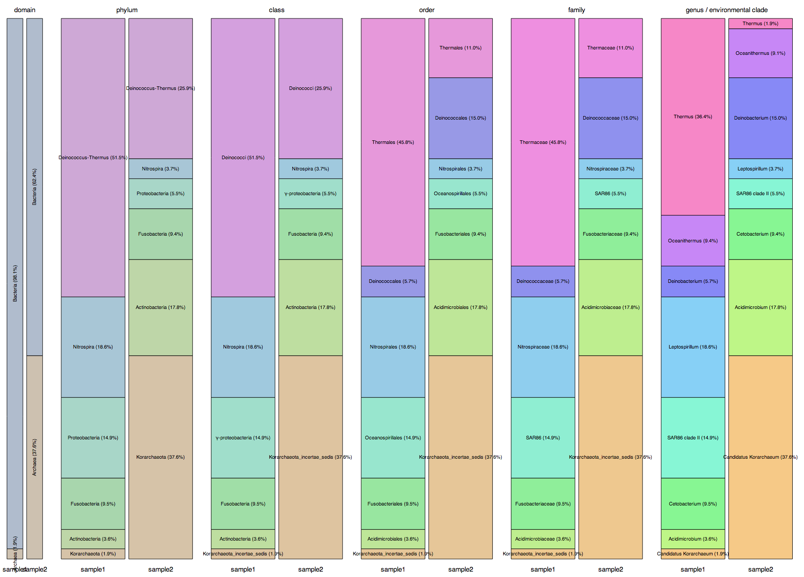

<link href="../../documentation/style.css" media="screen" rel="stylesheet" type="text/css" />

Using SEAStAR and RDP to estimate relative abundance of 16S sequences in a metagenomic data set
==============================

One of SEAStAR's core use cases is to select seqeunces from a reference database which are present in a short-read metagenomic data set and to estimate their relative abundances in the sample. For example, one may wish to estimate bacterial and archaeal 16S abundances using the [RDP][] database. The workflow for this process is captured in two Bash scripts, [`RDP_prep`][] and [`RDP_go`][].

## An example using simulated data

### Requirements

- OS X or Linux
- SEAStAR, successfully built with `bin` directory placed in your path
- [BWA][].  For colorspace data BWA version <= 0.5.10 is required. For nucleotide data the most recent version at the time of this documentation (0.7.3) will work. This tutorial uses nucleotide read data, so any version of BWA should work.

### Walk-through

An example data set has been provided in `vignettes/RDP/sim`.  Two FASTQ files of [ART][] simulated 50 bp Illumina reads were created based on a reference set of eight 16S sequences from RDP.  Reads in the two samples were simulated at different fold coverages for the same reference sequences to illustrate the use of the RDP pipeline to compare multiple metagenomic samples.

`sample1.single.fastq`

`sample2.single.fastq`

Below is a table of the sequences used and their simulated fold coverages.

| RDP ID     | Sample 1 cov, % | Sample 2 cov, % | lineage |
| -----------|-----------------|-----------------|-------- |
| S000000075 | 100x, 37.0 | 5x, 1.9 | Root; Bacteria; Deinococcus-Thermus; Deinococci; Thermales; Thermaceae; Thermus |
| S000005187 | 50x, 18.5 | 10x, 3.7 | Root; Bacteria; Nitrospira; Nitrospira; Nitrospirales; Nitrospiraceae; Leptospirillum |
| S000498962 | 40x, 14.8 | 15x, 5.6 | Root; Bacteria; Proteobacteria; Gammaproteobacteria; Oceanospirillales; SAR86; SAR86 clade II |
| S000020432 | 25x, 9.3 | 25x, 9.3 | Root; Bacteria; Fusobacteria; Fusobacteria; Fusobacteriales; Fusobacteriaceae; Cetobacterium |
| S000134123 | 25x, 9.3 | 25x, 9.3 | Root; Bacteria; Deinococcus-Thermus; Deinococci; Thermales; Thermaceae; Oceanithermus |
| S000431293 | 15x, 5.6 | 40x, 14.8 | Root; Bacteria; Deinococcus-Thermus; Deinococci; Deinococcales; Deinococcaceae; Deinobacterium |
| S000367885 | 10x, 3.7 | 50x, 18.5 | Root; Bacteria; Actinobacteria; Actinobacteria; Acidimicrobidae; Acidimicrobiales; Acidimicrobineae; Acidimicrobiaceae; Acidimicrobium |
| S000390161 | 5x, 1.9 | 100x, 37.0 | Root; Archaea; Korarchaeota; Candidatus Korarchaeum |

In order to keep the runtime of this example reasonable we'll create our own RDP database file to align against composed of just these sequences plus seven more 16S sequences.  These sequences can be found in `RDP_slim.fasta`.

| RDP ID     | lineage |
| -----------|-------- |
| S000458920 | Root; Bacteria; Deinococcus-Thermus; Deinococci; Thermales; Thermaceae; Vulcanithermus |
| S000011652 | Root; Bacteria; Nitrospira; Nitrospira; Nitrospirales; Nitrospiraceae; Thermodesulfovibrio |
| S000901535 | Root; Bacteria; Proteobacteria; Gammaproteobacteria; Oceanospirillales; Oceanospirillaceae; Amphritea |
| S000379106 | Root; Bacteria; Fusobacteria; Fusobacteria; Fusobacteriales; Fusobacteriaceae; Psychrilyobacter |
| S000443854 | Root; Bacteria; Actinobacteria; Actinobacteria; Acidimicrobidae; Acidimicrobiales; Acidimicrobineae; Acidimicrobiaceae; Ferrimicrobium |
| S000357634 | Root; Archaea; Euryarchaeota; Halobacteria; Halobacteriales; Halobacteriaceae; Haladaptatus |
| S000004750 | Root; Bacteria; Firmicutes; Bacilli; Lactobacillales; Aerococcaceae; Facklamia |

First we'll move to the simulated data directory `sim`.

    cd sim

Next we need to download the RDP Classifier [software][RDP_Classifier_Download] and training set [data][Training_Set_Download] to this directory.  For this example I used classifier software version 2.5 and training set version 9.  Some browsers will automatically unzip these downloaded zip files.  If that's the case then skip the next step.  Otherwise, unzip the RDP software and training set archives.

    unzip RDPClassifier_16S_trainsetNo9_rawtrainingdata.zip  # skip if browser automatically unzips
    unzip rdp_classifier_2.5.zip  # skip if browser automatically unzips

Now move the training set files to a convenient location and add a newline to the end of the file the hierarchical taxonomy file.  The last step is a workaround for the fact that the trainset9_db_taxid.txt file does not end in a newline, which makes appending  lines tricky.

    mv RDPClassifier_16S_trainsetNo9_rawtrainingdata/* .   # move files to more convenient location
    echo "" >> trainset9_db_taxid.txt   # add missing final newline

The next step is to expand the RDP Classifier training set to cover an unrepresented bacterial clade common in marine environmental samples, SAR86.  RDP sequence `S000498962` has a taxonomic lineage of: 

> Root; Bacteria; "Proteobacteria"; Gammaproteobacteria

but we in fact know that this sequence is a representative of SAR86 clade II.  To add this clade to the training set we will append a custom FASTA entry to the training set sequence file, `trainset9_032012.fa`.  This custom entry has been updated to define the correct lineage for this sequence.

> \>AF279106|S000498962 Root;Bacteria;"Proteobacteria";Gammaproteobacteria;Oceanospirillales;SAR86; SAR86 clade II"  
> agagtttgatcatg...

In addition, the training set's taxonomic hierarchy file must be updated to reflect the new entries in the taxonomic lineage and connect them to the existing tree.  The following lines should be appended to `trainset9_db_taxid.txt`.

> 4000\*SAR86\*1694\*5\*family  
> 4001\*"SAR86 clade II"\*4000\*6\*genus

This can be achieved using our example data set with these commands:
    
    cat SAR86_custom_sequence.fasta >> trainset9_032012.fa
    cat SAR86_custom_db_taxid.txt >> trainset9_db_taxid.txt

Next we'll run [`RDP_prep`][] to train the classifier with our custom training set, index our slimmed down RDP database, and specify where to find the RDP classifier software.

    RDP_prep -s rdp_classifier_2.5 -f trainset9_032012.fa -t trainset9_db_taxid.txt -d RDP_slim.fasta -o RDP_db

Finally we'll run [`RDP_go`][] to estimate abundance of reference sequences and classify selected sequences with the RDP Classifier.

    RDP_go -r RDP_db -o RDP_results sample1 sample2

The output of the pipeline can be viewed as per sample tables in files named `RDP_results/<sample_prefix>_final_class.txt`.  The relative percent abundance is appended to the RDP sequence identifier in column 1 of each line, and the RDP Classifier determined taxonomic lineage with confidence is shown in the remaining columns.

The output of the pipeline can also be viewed as an aggregated bar plot for all samples by opening the file `RDP_results/html/tree_bars.html` in a web browser.

## Command Reference

[`RDP_prep`]: #RDP_prep
<a name="RDP_prep">`RDP_prep`</a>
-------------------------

RDP_prep creates a new directory which contains

- copy of the RDP reference fasta file and associated aligner-specific index files
- copy of the RDP Classifier software directory
- processed RDP Classifier training data files in the subfolder `trained`
- JSON file `RDP_expand.json` representing the training set taxonomic hierarchy

It depends on [`RDP_index`][].

####Usage:   `RDP_prep [-c] -d <ref> -s <classifier> -f <training_seq> -t <training_tax> -o <out_dir>`

**`-h` / `--help`**

Request help.

**`-c`**

Colorspace data [FALSE]

**`-d <ref>`**

RDP sequence fasta file.  Can be gzipped with .gz extension. (required)

**`-s <classifier>`**

RDP classifier software directory or zip file. (required)

**`-f <training_seq>`**

RDP classifier training set fasta file.  Can be gzipped with .gz extension. (required)

**`-t <training_tax>`**

RDP classifier training set taxonomy file.  Can be gzipped with .gz extension. (required)

**`-o <out_dir>`**

Output directory. (required)

[`RDP_go`]: #RDP_go
<a name="RDP_go">`RDP_go`</a>
-------------------------
RDP_go encapsulates a series of step which

- align reads against the RDP database
- select reference sequences present in the sample based on initial alignments and create a new, reduced reference database with just these selected sequences
- re-align reads against reduced database
- produce final abundance estimates and selected sequences based on alignments to reduced database
- taxonomically classify selected RDP sequences with the RDP Classifier

It depends on [`RDP_align`][].

####Usage:   `RDP_go [options] <prefix>`

**`-h` / `--help`**

Request help.

**`-r <prep_dir>`**

RDP database directory created by RDP_prep (required)

**`-l <int>`**

Maximum number of reference mappings before a read is rejected from consideration [5000]

**`-t <float>`**

Minimum bitscore value for a ref sequence to be selected by ref_select during initial RPD selection step [75.0]

**`-f <float>`**

Minimum bitscore value for a ref sequence to be selected by ref_select, as a fraction of the top scoring sequence.  Used by ref_select during initial RDP selection step [0.00125]

**`-o <out_dir>`**

Output directory (required)

**`-c`**

Colorspace data [FALSE]

**`-d`**

Debug.  Do not remove intermediate files [FALSE]

It may be beneficial to customize the alignment module of this pipeline.  As provided, alignment is performed locally using up to two threads with BWA.  While this is fine for processing an example data set, most real world uses can benefit from distributing the alignment across multiple computers and/or using a different alignment program.  To aid this kind of customization, aligner specific reference indexing and read alignment have been abstracted to two scripts called [`RDP_index`][] and [`RDP_align`][].  The only requirements when amending these scripts are that:

- the aligner returns all equally good alignments for each read (equivalent to a very high value for bwa samse -n)
- they keep the same behavior and command-line (CLI) interface as the original scripts.

[`RDP_index`]: #RDP_index
<a name="RDP_index">`RDP_index`</a>
-------------------------

####Usage:   `RDP_index [options] <reference_fasta>`

`<reference_fasta>` is the fasta file to index.  The output index files will be writte to the same directory as `<reference_fasta>`.  The set of index files will be referred to by the filename of `<reference_fasta>` in downstream RDP pipeline tools.

**`-c`**

Colorspace data (not necessary to implement if colorspace reads are never used) [FALSE]

[`RDP_align`]: #RDP_align
<a name="RDP_align">`RDP_align`</a>
-------------------------

####Usage:   `RDP_align [options] <index> <fastq_prefix> <out_dir>`

`<index>` is the same as `<reference_fasta>` above.

`<fastq_prefix>` refers to a set of FASTQ files.

`<out dir>` is a new directory to be created which will contain one gzipped SAM file for each FASTQ file.  Gzipped SAM files will be named as fastq_prefix.<read_type>.sam.gz where `<read_type>` is e.g. `read1`.

**`-c`**

Colorspace data (not necessary to implement if colorspace reads are never used) [FALSE]

[RDP]: http://http://rdp.cme.msu.edu/
[BWA]: http://sourceforge.net/projects/bio-bwa/files/
[ART]: http://www.niehs.nih.gov/research/resources/software/biostatistics/art/
[RDP_Classifier_Download]: http://sourceforge.net/projects/rdp-classifier/files/rdp-classifier/
[Training_Set_Download]: http://sourceforge.net/projects/rdp-classifier/files/RDP_Classifier_TrainingData/
