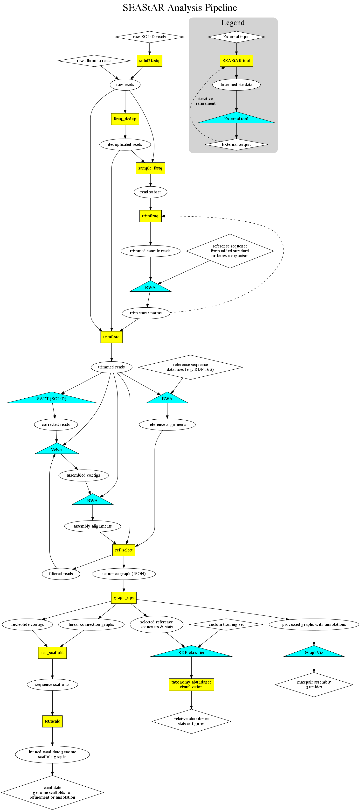

<link href="style.css" media="screen" rel="stylesheet" type="text/css" />

SEAStAR User Guide, version 0.4.0
==============================
####Vaughn Iverson and Chris Berthiaume

#####[Armbrust Lab](http://armbrustlab.ocean.washington.edu), School of Oceanography, University of Washington

Table of Contents
------------------------------
- [Introduction][introduction]
- [Quick Start][quick_start]
- [Command Reference][command_reference]
- [File Formats][file_formats]
- [Miscellaneous Scripts][misc_scripts]

[introduction]: #introduction
<a name="introduction">Introduction</a>
------------------------------
The SEAStAR tools are a collection of programs which implement many data and processing intensive steps in next-generation sequencing analysis pipelines. The tools quantitatively analyze alignments to reference sequence databases (including de novo assembled contigs), to produce a wide variety of statistics and relationships, including producing binned, assembled genomic scaffolds. At one time, SEAStAR was an acronym for **S**elect and **E**stimate **A**bundance from **S**hor**t** **A**ligned **R**eads. However, as described above, the tools and their capabilities have expanded well beyond that description, and so now SEAStAR is just our name for the in-house components of our analysis pipeline.

Our philosophy has been to create stable, modular, high-performance tools that fill important gaps we encountered between other established pre-existing tools in our pipeline. As such, you will see references to other packages throughout this document. We recognize that considerable innovation is ongoing in analysis software for next generation sequence, and so we have maintained a modular, pipelined approach to permit experimentation with, and substitution of, new tools as they become available.  Due to the wide variety of different computational environments that undoubtedly exist in different labs and institutes, our focus will be on releasing stable, documented, portable and high performance *components* from our analysis pipeline, but not the pipeline scripts themselves. This is because these scripts will need to be highly customized for both the goals and computational environment of any specific project.

Initially our goal was to release tools to enable others to work directly with datasets generated by the Life Technologies SOLiD&trade; sequencing platform. We recognized that most of the components we have developed are also valuable for use with Illumina&reg; sequence data, or with a mixture of sequence data types, and so in this release we have generalized most components to support both colorspace and nucleotide reads.  
   
###Technical guidance

The next-generation sequence datasets that the SEAStAR tools are designed to work with are typically very large (>> one billion reads). All compiled components of the SEAStAR tools are multithreaded and optimized for modern multi-core processors. Many SEAStAR tools will take advantage of 8 or more cores, particularly when compressed (gzip format) input and output files are being processed. When running on such a system, you will find that these components may run considerably more than 10x faster than equivalent tools written in a scripting language such as Python. For this reason, the operation of such tools will often be "I/O bound"; that is: the performance bottleneck is the speed of the disk(s) and/or network connections connected to the workstation, and not the availability of CPU cycles. The use of compressed files and local, separate independent disks for input and output files can often relieve some of this bottleneck and further improve run times.

Several of the SEAStAR tools (as well as many other tools used by our pipeline) have very high memory requirements when working with typical next-generation sequence datasets. We note these cases in the discussion of each individual SEAStAR tool, and attempt to provide guidance about the impact different parameters will have on memory use. However, in general, doing this kind of work will require a workstation with at least 32 gigabytes of RAM, and depending on the dataset and the types of analysis your project requires, you may require some multiple of that amount (64, 128, 256, or even 512 gigabytes) to successfully implement an analysis pipeline that meets your needs. When running these tools, it is highly advisable to set a session limit on the memory a process can attempt to allocate, to prevent machines from crashing and impacting other users who may be logged in. For example, adding the Unix shell command:

    ulimit -v 64000000

to any script that invokes high memory tools will effectively prevent a 64GB machine from being unintentionally brought down (i.e. thrashing the swap file) by an application that attempts to allocate more memory than is physically available.

###License and citation

The SEAStAR tools are open source and are currently publicly distributed under the [GPL version 3 license](http://gplv3.fsf.org/), a copy of which is provided in a file names `COPYING` in the project root directory. By using this software, you are agreeing to be bound by the terms of this license. Please contact the authors if you are interested in discussing an alternative licensing arrangement.

We are in the process of preparing several publications specific to the SEAStAR analysis pipeline and the custom tools it contains. In the interim, we ask that you cite the following paper (which was the first to use and describe these tools):

>Iverson, V., Morris, R. M., Frazar, C. D., Berthiaume, C. T., Morales, R. L .and Armbrust, E. V., Untangling Genomes from Metagenomes: Revealing an Uncultured Class of Marine Euryarchaeota, [*Science* **335** pp.587-590](http://www.sciencemag.org/content/335/6068/587.abstract) (2012)

[quick_start]: #quick_start
<a name="quick_start">Quick Start</a>
------------------------------

This section is a quick introduction to using SEAStAR tools for some common use cases. For installation instructions for SEAStAR itself, see the `README` file in the SEAStAR root directory. Although the SEAStAR tool can be quite memory and resource intensive, with the data used in this tutorial you should be able to comforably complete all of the steps below on a modern laptop with a dual-core processor and 4GB of RAM.

The data used in these examples are actual raw SOLiD sequence reads corresponding to the [Lambda phage](http://www.ncbi.nlm.nih.gov/nuccore/NC_001416.1) genome, and can be found in the `test_data` directory of the SEAStAR source tree. Copy the following files from that directory to a new working directory.

	test_data/lambda_reads_F3.csfasta.gz
    test_data/lambda_reads_F3_QV.qual.gz
    test_data/lambda_reads_R3.csfasta.gz
    test_data/lambda_reads_R3_QV.qual.gz
    
And make sure that your `PATH` environment variable points to your SEAStAR binaries directory:

    export PATH=$PATH:[dir]/bin   # Where [dir] is the fully qualified path to your SEAStAR destination tree 

**NOTE:** to work your way through all of the examples in this tutorial, you will also need the following external tools, in addition to those that were required to build SEAStAR:

+ [Velvet](http://www.ebi.ac.uk/~zerbino/velvet/)
+ [BWA](http://sourceforge.net/projects/bio-bwa/files/) -- **Version 0.5.10**. *Important!! Because newer versions do not support the SOLiD colorspace reads used by this tutorial*
+ [GraphViz](http://www.graphviz.org/Download.php)

###Read preparation

Convert SOLiD `.csfasta` and `.qual` files to gzipped `.fastq` files. Users with no colorspace data will omit this step in their analysis pipeline, although the FASTQ file naming conventions still need to be followed for nucleotide (e.g. Illumina) reads; see the [FASTQ][FASTQ] appendix for details.

    solid2fastq -z lambda_reads lambda_conv

Remove presumed PCR duplicate reads, identified by mate-pairs seen more than once.

    fastq_nodup -z -l 13 -d 2 -e 3 lambda_conv lambda_dedup

Trim and filter the de-duplicated FASTQ reads based on read quality, information content, and length.

    trimfastq -z --mates_file -p 0.9 -l 34 -m 34 --add_len -e 3.0 lambda_dedup lambda_trim

Randomly sample reads from `.fastq` files, retaining approximately 10% of the original reads. Randomly subsampled read sets are useful for quickly tuning the parameters of `trimfastq` for a given set of reads against some reference. We won't do that here, but tuning the `trimfastq -p` setting is important for getting clean assemblies and maximizing the useful information in your sequence data.

    samplefastq -z -f 0.1 lambda_trim lambda_samp

###*De novo* contig assembly

If the colorspace aware build of the *de novo* assembly tool [Velvet](http://www.ebi.ac.uk/~zerbino/velvet/) is installed it can be used to assemble lambda colorspace contigs.  First re-trim reads at a stricter quality cutoff and output a Velvet style `.fastq` file of interleaved mate-pairs, then assemble with Velvet.

    velveth_de lambda_asm/ 15 -fastq.gz -shortPaired lambda_trim.mates.fastq.gz -short lambda_trim.single.fastq.gz > lambda_asm.velveth_de.log 2>&1
    velvetg_de lambda_asm/ -scaffolding no -read_trkg no -ins_length auto -ins_length_sd auto -exp_cov 50 -cov_cutoff 5 -min_contig_lgth 50 > lambda_asm.velvetg_de.log 2>&1

There will now be a subdirectory called `lambda_asm` with a file called `contigs.fa` in it. These are the colorspace contigs we will use in the next section.

###Aligning reads to a reference

For this example, you need If the short read aligner [BWA](http://sourceforge.net/projects/bio-bwa/files/) (version <= 0.5.10) is installed it can be used to align de-duplicated and trimmed lambda FASTQ reads against the lambda reference genome. IMPORTANT: This quickstart example will not work with versions of BWA version 0.6.0 or newer because colorspace support was removed from BWA at that point. For your own work, if you are using nucleotide reads, you are free to use any alignment software you wish that produces standard SAM files. 

    # Because these are colorspace contigs and BWA expects nucleotide reference sequences, 
    # we need to convert the colorspace contigs to nucleotides using a single starting 
    # nucleotide (this will be wrong 3/4 of the time, but it doesn't matter because
    # BWA immediately converts the reference back to colorspace internally...)
	# Note: replace [SEASTAR_path] below with the path to your SEASTAR "destination tree" 
	# directory from when you built the tools.
	
    gawk -f [SEASTAR_path]/bin/csfasta2ntfasta.awk lambda_asm/contigs.fa > lambda_contigs.fna
    
    bwa index -a is -c lambda_contigs.fna
    bwa aln -c -n 0.001 -l 18 lambda_contigs.fna lambda_trim.read1.fastq.gz > lambda_trim.read1.sai
    bwa samse -n 1000000 lambda_contigs.fna lambda_trim.read1.sai lambda_trim.read1.fastq.gz 2>lambda_trim.read1.samse.log > lambda_trim.read1.sam
    bwa aln -c -n 0.001 -l 18 lambda_contigs.fna lambda_trim.read2.fastq.gz > lambda_trim.read2.sai
    bwa samse -n 1000000 lambda_contigs.fna lambda_trim.read2.sai lambda_trim.read2.fastq.gz 2> lambda_trim.read2.samse.log > lambda_trim.read2.sam
    bwa aln -c -n 0.001 -l 18 lambda_contigs.fna lambda_trim.single.fastq.gz > lambda_trim.single.sai
    bwa samse -n 1000000 lambda_contigs.fna lambda_trim.single.sai lambda_trim.single.fastq.gz 2>lambda_trim.single.samse.log > lambda_trim.single.sam

The resulting alignment files are in SAM format, which is what the next operation requires.

###Constructing an assembly graph

Now we will use the `ref_select` tool to convert the colorspace contig sequences to nucleotides and output the matepair assembly graph JSON file.

    ref_select -q -m -r lambda_trim.read1.fastq.gz -r lambda_trim.read2.fastq.gz -r lambda_trim.single.fastq.gz lambda_trim.read1.sam lambda_trim.read2.sam lambda_trim.single.sam > lambda_asm.json

###Producing scaffolded sequence

    # The following chain of graph_ops commands accomplish the following steps:
    # MST - Convert the assembly graph into a directed spanning tree
    # PLUCK - Remove short (stub) branches from the tree, leaving a mostly linear structure
    # PRUNE - Cleave any remaining branches from the tree, leaving linear backbones
    # PUSH - Put back contigs removed from the ends of the scaffolds by PLUCK
    # INSERT - Put back small contigs that fit between the backbone contigs 
    # SCAFF - Re-linearize the scaffolds based on constraints added by INSERT
    # FASTA - Join all neighboring contigs together (looking for overlaps) and write FASTA to STDOUT
    
    graph_ops lambda_asm.json MST PLUCK PRUNE PUSH INSERT SCAFF FASTA '{"scaff":true}' > lambda_scaffs.fna 

###Visualizing the sequence graph, and using `SCRIPT` files with `graph_ops`.	
    
If you rerun `graph_ops` using the `DOT` command at each stage of the pipeline, you can then visualize the assembly graph as it progresses through each stage of processing using [Graphviz](http://www.graphviz.org/).

First, create a text file called `lambda_viz.go` with the following contents:

    # Sample script file for SEAStAR graph_ops tool
    DOT {"file":"lambda_asm#.dot"}
    MST
    DOT {"file":"lambda_asm#.dot"}
    PLUCK
    DOT {"file":"lambda_asm#.dot"}
    PRUNE
    DOT {"file":"lambda_asm#.dot"}
    PUSH
    DOT {"file":"lambda_asm#.dot"}
    INSERT
    DOT {"file":"lambda_asm#.dot"}
    SCAFF
    DOT {"file":"lambda_asm#.dot"}
    FASTA {"scaff":true,"file":"lambda_scaffs.fna"}

Now run the following command:

    graph_ops lambda_asm.json lambda_viz.go

This will produce the same scaffolded assembly as the previous example, while writing a `DOT` format file at each step in the pipeline (with an incrementing number at the end of the filename: `lambda_asm0.dot`, `lambda_asm1.dot`, etc.) The next command will convert all of these `DOT` files to corresponding PDF figures using the `neato` layout engine in Graphviz. 	 

    # After this command, load the output PDF files in a viewer to see the scaffold layout
    # process, step by step. Circles are contigs with area proportional to sequence length  
    # and color by %GC. Black arrows are mate-pair connections with thickness indicating  
    # bitscore. Red arrows are added dependencies to produce a fully ordered layout for SCAFF.
    
    for i in lambda_asm?.dot; do neato -Tpdf $i > ${i##.*}.pdf; done

You should now be able to load the PDF files with your favorite PDF viewer in order from `lambda_asm0.pdf` through `lambda_asm7.pdf` to see the effect of each `graph_ops` command.

###Estimating 16S sequence abundance

The tools in SEAStAR can be used to create a pipeline for estimating sequence abundance in a short-read data set.  This is particularly useful for assessing community composition in a metagenomic sample through alignments to a 16S database.  See [RDP vignette](vignettes/RDP/RDP_vignette.html) for a walk-through of an implementation of this pipeline using the [RDP](http://rdp.cme.msu.edu/) 16S database.

******************

[command_reference]: #command_reference
<a name="command_reference">Command Reference</a>
=========================

Tools described in this user guide:

+ **[`solid2fastq`][]** -- Conversion of _SOLiD specific_ CSFASTA/QUAL or FASTQ files to SEAStAR style [FASTQ][] format files  
+ **[`fastq_nodup`][]** -- Reference-free PCR deduplication of paired reads
+ **[`samplefastq`][]** -- Subsamples reads randomly
+ **[`trimfastq`][]** -- Tunable, pairing aware read-trimmer
+ **[`ref_select`][]** -- Converts SAM reference alignments into [JSON][] "sequence graph" files for assembly and abundance analyses
+ **[`graph_ops`][]** -- A toolkit for operating on the `ref_select` "sequence graph" files to produce assemblies and data tables 
+ **[`seq_scaffold`][]** -- Converts pre-ordered and oriented contigs into scaffolded sequence, filling gaps where possible
+ **[`tetracalc`][]** -- Clusters sequence scaffolds into "species-level" taxonomic bins for final assembly
+  **[misc_scripts][]** -- Miscellaneous scripts

*****************

[`solid2fastq`]: #solid2fastq
<a name="solid2fastq">`solid2fastq`</a>
-------------------------

This tool converts SOLiD colorspace `.csfasta` and `.qual` input files (raw reads transferred off the instrument) to output files that are an interoperable variant of the FASTQ file format (see SEAStAR format details in section [FASTQ][]).  It can also convert nucleotide FASTQ files produced by runs using Exact Call Chemistry to SEAStAR style FASTQ files.  This is conversion necessary to ensure that read pairs are synced in `.read1.fastq` and `.read2.fastq`.

####Usage:   `solid2fastq [options] <in_prefix> <out_prefix>`

Where `<in_prefix>` denotes the input prefix which is the part of the input filename shared in common between all `.csfasta` and `.qual` or `.fastq` files generated by the same sequence library. It is typically shown in the `Title:` comment line near the top of `.csfasta` format input files.  For example: 

`# Title: GG050409_20090604_matepair_50` 

is found near the top of input files: 

`GG050409_20090604_matepair_50_R3.csfasta`, `GG050409_20090604_matepair_50_R3_QV.qual`, `GG050409_20090604_matepair_50_F3.csfasta` and `GG050409_20090604_matepair_50_F3_QV.qual`.

So use of `GG050409_20090604_matepair_50` for `<in_prefix>` will specify these four files for input to the `solid2fastq` tool.

Note that `solid2fastq` relies on the SOLiD naming conventions for the suffixes of these files (e.g. `_R3.csfasta`).  You are free to rename these files with different prefixes, but the suffixes must remain the same.  You may, however, compress these files using gzip and add the customary `.gz` suffix at the very end of the filename, which tells `solid2fastq` to decompress the files as it reads them.

The `<out_prefix>` parameter is similar to the `<in_prefix>` as it is used to name the output `.fastq` file(s) generated by this tool.  The output prefix may be any text, except you should generally avoid whitespace and punctuation characters other than "`_`".  This is because, by default, the names of all output reads are also prefixed with this string and the variant of the FASTQ format used by the SEAStAR tools depends on certain punctuation characters to quickly parse these read names (see SEAStAR [FASTQ][FASTQ] format ).  This file naming constraint may be relaxed through the use of optional parameters described below.

Note that `<in_prefix>` and/or `<out_prefix>` may contain directory path information, but in the case of `<out_prefix>` this will necessitate the use of the `--prefix` or `--no_prefix` options (described below).

`solid2fastq` writes a single output `.fastq` file for each matching pair of `.csfasta` / `.qual` input files or for each single `.fastq` input file.  For example, given a set of non-barcoded colorspace input files, the names of these output files are constructed as:

`<in_prefix>_R3[.csfasta|_QV.qual]` &rarr; `<out_prefix>.read1.fastq`

`<in_prefix>_F3[.csfasta|_QV.qual]` &rarr; `<out_prefix>.read2.fastq`

singlets from F3/R3 &rarr; `<out_prefix>.single.fastq`

Note that for paired-end libraries, alternate naming suffix conventions for the R3 input are also recognized (substituting `F5-BC`, `F5-P2`, `F5-DNA`, `F5-RNA`, for `R3`).

Additionally, for paired libraries (mate-paired or paired-end) should `solid2fastq` encounter any singlet reads (those with a missing mate), they are by default given the appropriate suffix and then written to a file named: `<out_prefix>.single.fastq`

The complete list of file name patterns that will be recognized by `solid2fastq` are:

`<in_prefix>_<BC>_R3.fastq` &rarr; `<out_prefix>.read1.fastq`  
`<in_prefix>_[R3|F5-BC|F5-P2|F5-DNA|F5-RNA][.csfasta|_QV.qual|.QV.qual]` &rarr; `<out_prefix>.read1.fastq`  
`<in_prefix>_<BC>_[R3|F5-BC|F5-P2|F5-DNA|F5-RNA][.csfasta|.QV.qual]` &rarr; `<out_prefix>.read1.fastq`  
`<in_prefix>_[R3|F5-BC|F5-P2|F5-DNA|F5-RNA]_[<BC>.csfasta|_QV_<BC>.qual]` &rarr; `<out_prefix>.read1.fastq`  
`<in_prefix>_<BC>_F3.fastq` &rarr; `<out_prefix>.read2.fastq`  
`<in_prefix>_F3[.csfasta|_QV.qual|.QV.qual]` &rarr; `<out_prefix>.read2.fastq`  
`<in_prefix>_<BC>_F3[.csfasta|.QV.qual]` &rarr; `<out_prefix>.read2.fastq`  
`<in_prefix>_F3_[<BC>.csfasta|_QV_<BC>.qual]` &rarr; `<out_prefix>.read2.fastq`  

####`solid2fastq` optional parameters `[options]`:
`[-h|--help]` `[--version]` `[--prefix=<string>]` `[-n|--no_prefix]` `[-z|--gzip]` `[-b <BC>|--bc=<BC>]` `[-s|--singles]`

**`-h` / `--help`**

Print a guide to valid command line parameters and their correct usage to the terminal, and then exit.

**`--version`**

Print the version number of the executing program and then exit.

**`--prefix=<string>`**    

Specify the prefix string to add to read identifiers. For example, `.csfasta` read identifier: `>1_68_381_R3` will become: `@xx+<string>:1_68_381/1` in the `.fastq` output file.  By default this is `<out_prefix>` described above. 

The use of a terse, but unique, prefix string is advisable because it helps identify the source, and processing steps, performed on a set of reads as they flow through an analysis pipeline. Keep in mind that this text will be added to the output file for every read, so short strings are preferable. The output prefix may be any text you would like, except you may not use whitespace or punctuation characters other than "`_`".

**`-n` / `--no_prefix`** 

Overrides the default read prefixing behavior and instead preserves the read identifiers as they are in the input `.csfasta` file(s).  

For example: `>1_68_381_R3` simply becomes `@xx+:1_68_381/1`

**`-x` / `--no_suffix`**

Suppress /1 or /2 suffix additions to read IDs.  This ensures matching read IDs for paired reads in FASTQ files and non-BWA aligner generated SAM files.

**`-z` / `--gzip`**

Write output `.fastq` files compressed in the gzip format, and with filenames suffixed `.gz`.

**`-b <BC>` / `--bc=<BC>`**

Used only for barcoded SOLiD libraries, in addition to `<in_prefix>`, to specify input files for a specific barcode (`<BC>`).

**`-s` / `--singles`**

Write two separate singlet files that segregate the singlets by input files. This is useful for doing strand-specific analyses using paired-end libraries, where the mated reads are sequenced from opposite strands. For example:

`<in_prefix>_R3[.csfasta|_QV.qual]` &rarr; `<out_prefix>.read1.fastq`

singlets from `R3` &rarr; `<out_prefix>.single1.fastq`

`<in_prefix>_F3[.csfasta|_QV.qual]` &rarr; `<out_prefix>.read2.fastq`
singlets from `F3` &rarr; `<out_prefix>.single2.fastq`

*****************

[`fastq_nodup`]: #fastq_nodup
<a name="fastq_nodup">`fastq_nodup`</a>
--------------------

This tool reads paired `.fastq` files (with associated singlets), and removes the lowest quality pair(s) of presumed PCR duplicate reads. This operation assumes that multiple read-pairs sharing substantially the same sequences for both mates are statistically unlikely to occur frequently at random (due to the distribution of insert sizes), and therefore represent likely artifactual duplications resulting from PCR over-amplification during library construction. If this assumption does not hold for a given library, then use of this tool is inappropriate. 

Notably, this tool is most appropriate for metagenomes (or any other sample type) where no reference genome is available for performing duplicate removal through reference alignments. This is because `fastq_nodup` works entirely through error-tolerant internal comparisons of read-pairs to each other within an entire sequenced library.

To accomplish this, `fastq_nodup` builds a large table of sequence prefixes, requiring a substantial amount of memory. The amount of memory required can be controlled through tuning the various parameters, but a minimum of 32Gb will probably be necessary for most read datasets.

Note that singlet reads are also randomly removed in the same proportion as matching mated reads. This is done assuming that PCR duplicated pairs are as likely to produce singlets as non-duplicated pairs. For example: 

`S1`, `S1`, `M1 -- M2`, `M1 -- M2`, `M1 -- M3` 

In the above example `Sn` = singlet reads, `Mn` = mated reads, and the numeric suffixes indicate matching sequences. So the lowest quality pair of `M1 -- M2` mates will be removed from the output, and each of the `S1` reads will have a 1/3 probability of being removed (disregarding quality). The 1/3 probability is calculated from the fact that 1/3 of the pairs containing sequence `M1` were presumed PCR duplicates and therefore removed.

####Usage:  `fastq_nodup [options] <in_prefix> <out_prefix>`

where `<in_prefix>` and `<out_prefix>` specify the input and output filename prefixes to use for input files and naming output files. For example:

`<in_prefix>.read1.fastq` &rarr; `<out_prefix>.read1.fastq`
`<in_prefix>.read2.fastq` &rarr; `<out_prefix>.read2.fastq`
`<in_prefix>.single.fastq` &rarr; `<out_prefix>.single.fastq`

The input files may be gzip format compressed files with the customary `.gz` suffix at the very end of the filename, which tells `fastq_nodup` to decompress the files as it reads them. Multiple single files (i.e. `.single1.fastq` and `.single2.fastq` suffixes) are also recognized.

####`fastq_nodup` optional parameters `[options]`:
`[-h|--help]` `[--version]` `[-v|--verbose]` `[-z|--gzip]` `[--prefix=<string>]` `[--no_prefix]` `[-l <u>|--index_len=<u>]` `[-m <u>|--match_len=<u>]` `[-d <u>|--index_err=<u>]` `[-e <u>|--match_err=<u>]` `[--seed=<n>]`

**`-h` / `--help`**

Print a guide to valid command line parameters and their correct usage to the terminal, and then exit.

**`--version`**

Print the version number of the executing program and then exit.

**`-v` / `--verbose`**

Print additional statistics and diagnostic information about the run.

**`-z` / `--gzip`**

Write output `.fastq` files compressed in the gzip format, and with filenames suffixed `.gz`.

**`--prefix=<string>`**

Specify the prefix string to add to read identifiers. For example: `@<string>:1_68_381`

Note, this will replace any existing prefix. By default this is `<out_prefix>` described above.

**`-n` / `--no_prefix`**

Overrides the default read prefixing behavior and instead preserves the read identifiers exactly as they are in the input fastq file(s).

**`-l <u>` / `--index_len=<u>`**        

Controls the read sequence prefix length of the search index. This should be set long enough so that random prefix collisions are infrequent, but short enough so that a large number of sequence errors are unlikely to accumulate. This parameter also impacts the memory use of this tool, with each increment increasing the index size by a factor of 4. This parameter defaults to `<u>`=14 nucleotides and may not exceed 32 nucleotides.

Both mates of each read-pair are indexed, and this indexed look-up is used to find a list of mate sequences corresponding to each sequence prefix. Given that the mates also must match, it is acceptable for a low-level of prefix collisions to occur in this index. That is, assuming the level of prefix collision is low (only a small number of non-duplicated reads share any given prefix), it will be highly improbable that reads matching a given prefix will share mates with matching sequence at random.

**`-m <u>` / `--match_len=<u>`**

Controls the required match length of the unindexed mate in detecting a duplicate pair. Like the previous parameter (`--index_len`), this setting has an impact on memory use, although memory requirements only increase linearly with match length. This parameter should be set as high as memory permits to improve specificity.   

This parameter defaults to the full read length, although lower settings are acceptable assuming that the `--index_len` is appropriately set, and the sum of `--index_len` and `--match_len` exceeds about 35 nucleotides (that is, random 35 nucleotide joint index-match collisions are extremely unlikely assuming each match is sufficiently long).

**`-d <u>` / `--index_err=<u>`**

Controls the number of mismatches tolerated in the indexed sequence prefix while still permitting a sequence match. This value defaults to `<u>`= 1 and may be set in the range 0-2.  This setting has a major impact on run time, with each increment increasing it by a factor of about 4. Duplicated reads with more than `--index_err` mismatches in the `--index_len` prefix may still be found by the mate's indexed prefix, assuming that it does not also have more than `--index_err` errors.  

**`-e <u>` / `--match_err=<u>`**

Controls the number of mismatches tolerated in a matched mate sequence (in the `--match_len` prefix). This value defaults to 3 and must be > 0. This setting has little impact on run time.  Setting `--match_err` to higher values will reduce the specificity of the mate-matching and should therefore be accompanied by correspondingly larger values of `--match_len`.

**`-seed=<n>`**

Integer seed used by the internal pseudo-random number generator. This only affects the random selection of matching singlets (as described above). Defaults to `<n>`= 12345. 

*****************

[`samplefastq`]: #samplefastq
<a name="samplefastq">`samplefastq`</a>
--------------------

This tool randomly samples reads from a given set of fastq files, producing a corresponding set of output fastq files.  This is useful for more quickly tuning parameters for the `trimfastq `tool (described below) and for producing simulated read datasets for various other purposes.  

####Usage: `samplefastq -f|--frac_sample=<float>|<int> [options] <in_prefix> <out_prefix>`

where the mandatory `-f` parameter indicates how the input files should be sampled and `<in_prefix>` and `<out_prefix>` specify the input and output filename prefixes to use for input files and naming output files. For example:

`<in_prefix>.read1.fastq` &rarr; `<out_prefix>.read1.fastq`
`<in_prefix>.read2.fastq` &rarr; `<out_prefix>.read2.fastq`
`<in_prefix>.single.fastq` &rarr; `<out_prefix>.single.fastq`

The input files may be gzip format compressed files with the customary `.gz` suffix at the very end of the filename, which tells `samplefastq` to decompress the files as it reads them. Multiple single files (i.e. `.single1.fastq` and `.single2.fastq` suffixes) are also recognized.

Note that for paired sequences (as shown above) read pairs are always sampled together; that is, each pair of reads counts at a single read unit for sampling purposes, as does each singlet read. 

####`samplefastq` mandatory parameter: 
`[-f|--frac_sample=<float>|<int>]`

**`-f <float>` / `-f <int>` / `--frac_sample=<float>` / `--frac_sample=<int>`**

The `-f` parameter tells `samplefastq`, either directly or indirectly, how many output reads to randomly sample from the input `.fastq` files.  Values < 1.0 are interpreted as a fraction of the input reads to retain, whereas values > 1.0 are rounded to an integer count of reads to retain.  

Note that when a read count is provided, the input files must be read twice by `samplefastq`; once to count the number of input reads, and then again to randomly sample those reads. Once the number of input reads is known, the requested read count is converted into a fraction and operation proceeds as though that fraction had been initially provided to the `-f` parameter. Therefore, if a given set of inputs is to be sampled repeated, it will be considerably more efficient to obtain the count of reads once and calculate the fraction to retain for each subsequent sampling. The requested (or calculated) fraction of reads to sample is used internally as the probability of retaining each read (or pair) and each is considered an independent trial. Because of this, the precise fraction (or count) of reads requested is unlikely to be generated, although the sampled output will typically be very close to that requested. 

####`samplefastq` optional parameters `[options]`: 
`[-h|--help]` `[--version]` `[--seed=<int>]` `[-z|--gzip]`

**`-h` / `--help`**

Print a guide to valid command line parameters and their correct usage to the terminal, and then exit.

**`--version`**

Print the version number of the executing program and then exit.

**`-z` / `--gzip`**

Write output fastq files compressed in the gzip format, and with filenames suffixed `.gz`.

**`--seed=<n>`**

Integer seed used by the internal pseudo-random number generator. To obtain different samples from the same input file(s), set this parameter to different values.  Repeated runs with all parameters the same will produce identical outputs.  Defaults to `<n>`= 12345.

*****************

[`trimfastq`]: #trimfastq
<a name="trimfastq">`trimfastq`</a>
--------------------

This tool is used to trim or reject individual reads on the basis of quality scores. Reads may also be rejected based on low information content (entropy). When run on paired reads, this operation is performed on mates independently, and when one mate of a pair is rejected, the other becomes a singlet.

Trimming based on quality scores is performed with the goal of producing trimmed reads that have a calculated probability of error below some threshold. That is, bases are trimmed off the 3' end of the read until the remaining bases have a joint probability of error below a threshold. For example, if a threshold of 0.5 is selected, that means the output reads will be expected to have, on average, 0.5 erroneous nucleotides per read. 

For colorspace (SOLiD differentially encoded) reads, the probability of error is calculated as the joint probability of error in each of two consecutive color positions. That is, because single color errors will typically be correctable, the probability of a nucleotide error at a given position is the probability that both corresponding color positions are erroneous (i.e. the pairwise product of color error probabilities yields the probability of uncorrectable nucleotide errors).

Minimum read lengths may also specified such that reads trimmed shorter than the specified minimum to meet an error probability threshold will instead be rejected.

Reads may also be independently rejected for failing to have a minimum mean information content. `trimfastq` optionally calculates the mean entropy of each read (as average bits per dinucleotide) and reject reads that fail to meet a given threshold. A common error for next-generation sequencers is to produce junk reads where all or part of the read contains highly repetitive (low information) sequence. Random DNA sequence contains 4 bits per dinucleotide of entropy, and we have observed that (non-repeat) natural sequences typically contain more than 3 bits per dinucleotide.

####Usage:  `trimfastq [options] <in_prefix> <out_prefix>`

where `<in_prefix>` and `<out_prefix>` specify the input and output filename prefixes to use for input files and naming output files. For example:

`<in_prefix>.read1.fastq` &rarr; `<out_prefix>.read1.fastq`

`<in_prefix>.read2.fastq` &rarr; `<out_prefix>.read2.fastq`

`<in_prefix>.single.fastq` &rarr; `<out_prefix>.single.fastq`

The input files may be gzip format compressed files with the customary `.gz` suffix at the very end of the filename, which tells `trimfastq` to decompress the files as it reads them. Multiple single files (i.e. `.single1.fastq` and `.single2.fastq` suffixes) are also recognized.

####`trimfastq` optional parameters `[options]`:
`[-h|--help]` `[--version]` `[-c|--color_space]` `[-z|--gzip]` `[-v|--invert_singles]` `[-s|--singles]` `[-p <d>|--correct_prob=<d>]` `[-l <u>|--min_read_len=<u>]` `[-m <u>|--min_mate_len=<u>]` `[-f <u>|--fixed_len=<u>]` `[--prefix=<string>]` `[--add_len]` `[--no_prefix]` `[-e <d>|--entropy_filter=<d>]` `[--entropy_strict]` `[--mates_file]`

**`-h` / `--help`**

Print a guide to valid command line parameters and their correct usage to the terminal, and then exit.

**`--version`**

Print the version number of the executing program and then exit.

**`-z` / `--gzip`**

Write output fastq files compressed in the gzip format, and with filenames suffixed `.gz+.

**`--prefix=<string>`**    

Specify the prefix string to add to read identifiers. For example: `@<string>:1_68_381`

Note, this will replace any existing prefix. By default this is  `<out_prefix>` described above.

**`-n` / `--no_prefix`** 

Overrides the default read prefixing behavior and instead preserves the read identifiers exactly as they are in the input fastq file(s).

**`--add_len`**

Add the final trimmed length value to the read prefix.  For example:

    @lambda:1_81_912
    TGTTGTGCGCGCCATAGCGAGGGGCTCAGCACGCGTCCCTCCGCCCCAC
    +
    5/0)358)%57*)%881/(/4'.'53*&#91*-'&,&%$''%&'46-+#`

Trims to:  ("37" in the first line indicates the final trimmed length)

    @37|lambda_trim:1_81_912
    TGTTGTGCGCGCCATAGCGAGGGGCTCAGCACGCGTC
    +
    5/0)358)%57*)%881/(/4'.'53*&#91*-'&,&

**`-v` / `--invert_singles`**

Causes singlet file(s) output to be the opposite configuration of the input.  That is:

`<in_prefix>.single.fastq` &rarr; `<out_prefix>.single[12].fastq`

or

`<in_prefix>.single[12].fastq` &rarr; `<out_prefix>.single.fastq`

Note that this option is only valid when there are input singlet reads.

**`-s` / `--singles`**

Write two singlet files (`.single1.fastq` and `.single2.fastq`), one for new singlets generated from each paired input file. Note that this option is only valid when there are no input singlet reads. The default behavior in this case is to write a single combined singlet file (`.single.fastq`).

**`-p <d>` / `--correct_prob=<d>`**

Minimum mean probability that trimmed output reads are free of uncorrectable errors (or all errors with `-c`).  Default value is `<d>`= 0.5.

**`-l <u>` / `--min_read_len=<u>`**

Minimum length of a singlet or longest-mate of a pair, in nucleotides. Default value is `<u>`= 24 bases.

**`-m <u>` / `--min_mate_len=<u>`**

Minimum length of the shortest mate of a pair, in nucleotides.  Default value is the value provided for  `--min_read_len`. This value must be < the value used for `--min_read_len`. Use of this parameter allows paired reads shorter than `--min_read_len` to be retained as long as their mate satisfies `--min_read_len`.  

**`-f <u>` / `--fixed_len=<u>`**

Trim all reads to a fixed length, still rejecting reads that don't meet specified quality thresholds at this length. Default is no fixed length.

**`-e <d>` / `--entropy_filter=<d>`**

Reject reads with mean per position measured information (entropy) below the given value (in bits per dinucleotide). The range of valid values is 0.0-4.0 inclusive. By default this filter is off.

**`--entropy_strict`**

Reject reads for low entropy overall, not just the retained part after trimming. By default this setting is off. Use of this setting requires use of `--entropy_filter`. 

**`--mates_file`**

In addition to other outputs, produce a Velvet compatible mate-paired output file (named `<out_prefix>_mates.fastq`) with read2 mates reversed as required. 

*****************

[`ref_select`]: #ref_select
<a name="ref_select">`ref_select`</a>
--------------------

ref_select is a utility for calculating a wide variety of useful information from alignments of next-generation sequence reads to large reference sequence datasets. For example, it can be used to build a meta-genomic assembly graph from paired-reads aligned back to *de novo* assembled contigs. It can also be used to precisely select (and accurately estimate the relative abundances of) sequences from an alignment with a reference library (e.g. metagenomic reads to 16S rDNA database, or mRNA transcript reads to a database of genes from one or more genomes.)

ref_select processes [SAM](http://samtools.sourceforge.net) format alignment files into a [JSON format "sequence graph"][JSON] file ready to be processed by the `graph_ops` tool. Optionally, ref_select will also read FASTQ files and filter out reads (and mates) which are or aren't present in the provided SAM alignment. The JSON output file is structured as a graph of "nodes" (selected sequences) and "edges" (connections between nodes based on read-pairing) A variety of useful information for the nodes and edges is included in the output JSON file, which can be accessed using the `graph_ops` tool or custom code written in any language with a JSON library.

####Usage: `ref_select [options] <sam_file1> [<sam_file2>]... > <outfile.json>`

`ref_select` has a lot of options, and depending on what type of analysis you are doing, you may use quite a few of them. However, at its simplest, `ref_select` reads one or more SAM alignment files and writes a JSON "sequence graph" to STDOUT:

    ref_select alignment.sam > seq_graph.json
    
Of course, since these types of files may be very large, you may prefer to keep everything compressed:

    ref_select alignment.sam.gz | gzip -c > seq_graph.json.gz

    
Because `ref_select` has many options, and produces many different kinds of outputs, we made the decision to organise all of the output data into a single output stream in a standard text-based format ([JSON][JSON_ref]), that is flexible and straightforward to process in any language. The JSON formatted output produced by `ref_select` is documented in the appendix: [JSON Sequence Graph File Format Reference][JSON]. However, for most tasks you will not need to look directly into theses files because the `graph_ops` tool will handle that work for you (including the work of extracting data into other standard file formats). 

`ref_select` has four main pieces of functionality:

1. Quantitatively analyzing reads aligned to a known reference database (e.g. metagenomic reads to a 16S rDNA database, or reads from mRNA transcripts to the gene models of one or more genomes):

        # Select only reference sequences with reads aligned scoring 100 or more bits
        ref_select -t 100.0 alignment_single.sam > ref_stats.json 
        
        # Convert ref_select output to a tab separated (TSV) table for use downstream
        graph_ops ref_stats.json TABLE > ref_stats.tsv   

2. Analyzing reads mapped back to *de novo* assembled contigs, to build a "sequence graph" for downstream quality checking, scaffolding, binning, visualization, etc.  

        # Construct a sequence graph from the alignment, inserting the assembled contig seqs into the graph 
        ref_select --ref=contigs.fna --m alignment_read1.sam alignment_read2.sam > seq_graph.json
        
        # Produce scaffolded sequence (where .go file is graph_ops SCRIPT)...
        graph_ops seq_graph.json run_scaffold_pipeline.go > scaffolds.fna

3. Converting SOLiD colorspace contigs into nucleotide contigs based on aligned reads

        # Rather than inserting contigs as above, they are reconstructed from the alignment
        # and the provided read FASTQ files
        ref_select -q -m -r mates.read1.fastq -r mates.read1.fastq alignment_read1.sam alignment_read2.sam > seq_graph.json

        # Produce scaffolded sequence (where .go file is graph_ops SCRIPT)...
        graph_ops seq_graph.json run_scaffold_pipeline.go > scaffolds.fna

4. Filtering out a sub-set of reads (and their mates) based on the results of an alignment.  

        # Write two new read files for all reads (and their mates) that did not map in the alignment
        # NOTE: this is the one exception to the "all data goes into the JSON stream" principle described above. 
        # Filtered read output data is written to `FASTQ` format files, with a prefix specified using --read_output
        ref_select --read_output=filtered_ --output_nomatch -r mates.read1.fastq -r mates.read1.fastq alignment_read1.sam alignment_read2.sam

The approach used by `ref_select` to accomplish these tasks are described in more detail in the methods section of ([Iverson, *et al.* 2012](http://www.sciencemag.org/content/335/6068/587.abstract)).  

The `[options]` reference below splits the various parameters into general categories related to the above tasks. 

###`ref_select` basic parameters `[options]` : 
`[-h|--help]` `[-v|--version]` `[--verbose]` `[-d <seq_id>|--detail=<seq_id>]...` `[--detail_file=<detail_file>]` `[-q|--recon_seq]` `[--ref=<ref_file>]` `[-m|--mate_pair]` `[--split=<n>]` `[--separate_strands]`  `[--rollup]` `[--seed=<n>]` `[--num_threads=<n>]` 

**`-h` / `--help`**

Request help.

**`-v` / `--version`**

Print the build version and exit.

**`--verbose`**

Print detailed diagnostic status to stderr during run. Off by default. 

**`-d <seq_id>` / `--detail=<seq_id>`**

Only produce per-base statistics and reconstructed sequence for listed seq ids. By default these things are done for all selected sequences. For very large reference sequence databases, ref_select needs to perform a lot of work and can use a lot of memory and produce a very large output. If you want to analyze the entire reference dataset, but only produce detailed results for a small subset of sequences, the `--detail` option allows you to specify just those sequences (by `<seq_id>`, one per use of `-d` / `--detail`). To specify more than a few sequences, use `--detail_file` instead.  

**`--detail_file=<detail_file>`**

Filename of file containing sequence ids to treat as in --detail. Format is a plain text file with one <seq_id> per line.

**`-q` / `--recon_seq`**

Enable reconstruction of contig sequences using alignment data (SAM) and reads (FASTQ). This works for both colorspace and nucleotide data (or a combination of the two), and the resulting sequence is always nucleotide sequence. The reconstructed contigs may contain ambiguity codes (e.g. for SNPs or variable positions) and the sensitivity of this process is controlled with the `ambig_tol` parameter. NOTES: Requires use of --read_file. If --detail is used, only specified sequences are reconstructed.  

**`--ref=<ref_file>`**

For assemblies where the contigs and alignments are already nucleotide sequences, this option allows you to specify a FASTA file containing the reference contigs used in the alignment (as an alternative to using --recon_seq). In this case, the reference sequences are simply copies into the output JSON sequence graph for use in downstream analysis (scaffolding, binning, etc).

**`-m` / `--mate_pair`**

This option is required to enable the pairing analysis between mated reads (`.read1` and `.read2` alignments). When paired reads are available and `--mate_pair` is used, "edges" will be included in the output JSON data file, connecting the "nodes" into a full sequence graph structure. Enable this option when you want to produce scaffolds for a *de novo* assembly.

**`--split=<n>`**

Split reference sequences into n-base pieces for analysis. The default is no splitting. This is a specialized option that performs all ref_select analyses as though large reference sequences (e.g. whole genomes) are actually split into many separate chunks. This can be useful for testing, but also for performing genome connection and rearrangement analyses when pairing information is available and the sequence read data is from a different organism (e.g. strain or closely related species) than the reference sequence used. 

**`--separate_strands`**

Top and bottom stands of reference sequences are considered separately. Each reference sequence effectively becomes two references, with reads mapping to each strand contributing to the analysis for that strand's reference only. NOTE: `--separate_strands` may not be used with: mate-pairing (`--mate_pair`), sequence reconstruction (`--recon_seq`) or splitting (`--split`)

**`--rollup`**

When `--split` is used, or when a `--catalog` file is specified (e.g. to join reference scaffolds or chromosomes into whole genomes), the output JSON data will include a `rollup_stats` object with information about each parent reference sequence (e.g. whole genome) calculated from the stats of the individual underlying sequences. 

**`--seed=<n>`**

SEAStAR uses its own random number generator (for reproducibility among different platforms). You may use a different seed to investigate what difference randomized decisions made in the analysis are having on the results. By default `--seed=12345`.

**`--num_threads=<n>`**

`ref_select` is highly multithreaded to support modern multi-core processors. Sometimes you will want to restrict the number of cores it uses (e.g. to prevent resource competition on clusters or shared computers, or when you are running more than one instance of `ref_select` at a time on a given computer.)  By default `--num_threads` is the number of cores on the machine (including "hyper-threads").

###`ref_select` parameters for bitscore calculation and reference selection `[options]` : 
`[-t <n>|--bit_thresh=<n>]` `[-f <n>|--bit_fraction=<n>]` `[-l <n>|--read_map_limit=<n>]` `[-s|--second_chance_reads]` `[--relax_read_sharing]` `[--all_taxa]` `[-a|--absolute_bitscores]` `[--no_rand]` `[--sim_frac=<n>]` `[-e <seq_id>|--exclude=<seq_id>]...` `[--exclude_file=<exclude_file>]` `[--invert_exclude]` 

**`-t <n>` / `--bit_thresh=<n>`**

Minimum bitscore value for a ref sequence to be selected for output. Default > 0.0, all sequences with a positive bitscore. NOTE: if both --bit_fraction and --bit_thresh are used, the highest resulting threshold will be used. Use of selection thresholds is useful for selecting a "noise floor" to exclude sequences that have only a small number of reads uniquely aligning, which in a large sequence database (e.g. 16S rDNA databases) may only reflect sequencing errors. 

**`-f <n>` / `--bit_fraction=<n>`**

Minimum bitscore value for a ref sequence to be selected for output, as a fraction of the bitscore for the top scoring sequence. NOTE: if both --bit_fraction and --bit_thresh are used, the highest resulting threshold will be used. 

**`-l <n>` / `--read_map_limit=<n>`**

Maximum number of reference mappings before a read is rejected from consideration. Default is 50000 reference sequences. Reads that map with a large fraction of the sequences in a reference database (e.g. low complexity reads, or highly conserved sequence) carry very little information but require a lot of computational effort and memory to process.  If your sequence database has a lot of conserved or redundant sequence (e.g. 16S rDNA), then this parameter will save a lot of computational expense with little if any effect on the results. If desired, a 2-pass approach can be used where reads are aligned to the full database and run through `ref_select` first to eliminate the vast majority of the database from consideration. Then in a second pass, reads are re-aligned to just the sequences selected in the first round, so that all aligning reads can be accounted for (e.g. in coverage and relative abundance calculations).  

**`-s` / `--second_chance_reads`**

Allow reads to be mapped to edit dist +1 mappings when their best ref is eliminated. By default, if a read maps to a sequence that ultimately doesn't meet the bitscore threshold being used limit selection, that read is removed from further downstream consideration, if it didn't also map at least as well with some other sequence that is ultimately selected for output. When `--second_chance_reads` is used, such reads gain a "second chance" to be reallocated to reference sequence(s) where they map with edit distance +1 from the eliminated best match(es). This parameter causes `ref_select` to use significantly more memory. Note: this has no effect when `--bit_fraction` and `--bit_thresh` are at their default values, or when `--relax_read_sharing` is used.

**`--relax_read_sharing`**

Allow reads to be mapped to all sequences, regardless of edit distance. By default, reads are only associated with the sequence(s) that they align with at the minimum edit distance. `--relax_read_sharing` causes reads to be associated with all sequence alignments, even if they are suboptimal relative to the best match. 

**`--all_taxa`**

Use count of all taxa in catalog to calculate bitscores. By default, any taxa in the reference database that have zero read alignments are excluded from consideration in the information theoretic bitscore calculations (ie. the calculations proceed as though those sequences didn't exist in the reference database at all).

**`-a` / `--absolute_bitscores`**

Use absolute bitscores to score and select reference sequences. By default length normalized scores (bits/nt) are used to control for differences in reference sequence length.

**`--no_rand`**

By default, reads that map equally well to multiple locations within a single reference sequence are randomly assigned to one of the possible positions. The `--no_rand` option changes this behavior so that such a read will be mapped to the first position in the reference seen in the alignment file. Counterintuitively, it is likely that using `--no_rand` will make the output of `ref_select` ***less*** deterministic. This is because the pseudo-random number generator used by SEAStAR is cross-platform deterministic, whereas the process by which such multiple alignments are ordered in an alignment SAM file may be at least paritally random (say through multi-thread race contingencies in the alignment software.)

**`--sim_frac=<n>`**

Fraction of aligned reads to use. Reads (and their mates) are randomly sampled from the input alignment(s) in this proportion. Primarily for use with simulated datasets.

**`-e <seq_id>` / `--exclude=<seq_id>`**

This option in conceptually similar to the `--detail` option, except that reference sequences identified with `--exclude` are discarded from the analysis entirely, as though they were not in the reference database to begin with. This is useful if a long, expensive alignment to a large reference sequence database has been completed, and then some downstream analysis calls for processing alignments with only a subset of that database.  

**`--exclude_file=<exclude_file>`**

Filename of file containing sequence ids to treat as in `--exclude`. Format is a plain text file with one `<seq_id>` per line.

**`--invert_exclude`**

`--exclude` or `--exclude_file` sequences are inverted; that is, exclude all sequences except those specified. 

###`ref_select` parameters for coverage calculations `[options]` : 
`[--per_base]` `[-w <n>|--cov_window=<n>]` `[--detect_dups]`  

**`--per_base`**

Per base statistics (coverage; and when `--mate_pair` is enabled, physical coverage and mean insert length) will be generated and output for all selected reference sequences (or only those specified by `--detail`).

**`-w <n>` / `--cov_window=<n>`**

Fixed read length for use in calculating per position coverage. By default the actual length of each read is used when available in the FASTQ readnames ([see the SEAStAR FASTQ format guide][FASTQ] for details.)  If the readnames do not include length information and `--cov_window` isn't specified, then 49 nucleotides is the default fixed read length used. 

**`--detect_dups`**

Perform additional analysis to detect likely collapsed duplications. Assumes relatively uniform coverage (i.e. a single isolate genome). Results are reported in the `contig_problems` section of the [JSON sequence graph][JSON]. 

####`ref_select` parameters for sequence reconstruction and read filtering `[options]` : 
`[--ambig_tol=<n>]` `[--read_output=<prefix>]` `[--output_nomatch]` `[--read_output_gzip]` 

**`--ambig_tol=<n>`**

Tolerance adjusting the sensitivity for generating ambiguity codes in output sequence reconstructed from read alignments. In the range: 0.0 - 1.0. 1.0 = no ambiguities, majority rules base calling. Default is 0.2

**`--read_output=<prefix>`**

Enables output of reads aligning with the refernce database (and their mates, regardless of whether the mates align.) `<prefix>` indicates the FASTQ output filename prefix to use in writing the new ouput files. Must be used with `--read_file` and/or `rev_read_file`.

**`--output_nomatch`**

Inverse the meaning `--read_output` to write only reads that do not align with any reference sequence (whose mates also do not align).

**`--read_output_gzip`**

Modifies `--read_output` to write gzip compressed output files.

###`ref_select` parameters for generating read pairing statistics `[options]` : 
`[--mp_mate_lim=<n>]` `[--mp_share_lim=<n>]` `[--mp_strict]` `[--mp_inserts]` `[--mp_circular]` `[--mp_cutoff=<n>]`

**`--mp_mate_lim=<n>`**

Minimum bitscore threshold for generation of a mate-pair linking edge in the output graph (normal or internal). Default is 250.0 bits.

**`--mp_share_lim=<n>`**

Minimum bitscore threshold for generation of a shared sequence edge in the output graph. Default is 500.0 bits.

**`--mp_strict`**

Do not consider paired reads that span reference sequences when the same pair of reads also map entirely within some single reference sequence. 

**`--mp_inserts`**

Perform insert size estimation for all reference sequences where at least one pair of reads both map within that sequence.

**`--mp_circular`**

Allow circular self-linking mate-pairs to join the opposite ends of a single sequence.

**`--mp_cutoff=<n>`**

Insert size cutoff for inclusion of an individual mate-pair in per base statistics. Setting this option for some reasonable upper limit of the length of a valid insert will prevent sequence duplications from improperly skewing estimation of the true mean insert size. 

###`ref_select` parameters for specifying additional input files `[options]` : 
`[-r <read_file>|--read_file=<read_file>]...` `[--rev_read_file=<read_file>]...` `[--old_bwa_samse]` `[-c <catalog_file>|--catalog=<catalog_file>]` `[--rev_align=<sam_file>]...` 

**`-r <read_file>` / `--read_file=<read_file>`**

Input filename(s) for FASTQ read files used for sequence reconstruction and/or read filtering.

**`--rev_read_file=<read_file>`**

Same as --read_file above, but used for paired reads that are on the opposite strand from each other. By default, `ref_select` assumes that paired reads are from the same DNA strand.  When this is not true, then one of the two readsets must be specified using `--rev_read_file`.  Note, this must be done consistently with the use of `--rev_align`.

**`--old_bwa_samse`**

Use the old BWA-style "samse" alignment format instead of SAM. This format was used by the BWA `samse -n` command until BWA version (TBD, look this up!)

**`-c <catalog_file>` / `--catalog=<catalog_file>`**

Filename of a reference catalog file. Required for use `--old_bwa_samse`. This is optional otherwise, although it is required to associate sequence descriptions with reference sequences in the JSON output, or for use of the `--rollup` functionality when reference sequences are actually subsequences of parent sequences (e.g. scaffolds or chromosomes of a whole genome). A catalog is a tab separated (TSV) plain text file with the following columns:

      seq_id     seq_len     parent_id   seq_description 

For example:

      ABCD123    1102938     ORG1        Organism 1, Scaffold 1
      EFGH987    482273      ORG1        Organism 1, Scaffold 2
      ZYXW765    193475      ORG2        Organism 2, Scaffold 1
      RTSP345    782273      ORG2        Organism 2, Scaffold 2

Note that each `seq_id` must be unique, but duplicated `parent_id` values indicate relationships among sequences (a shared parent sequence). 
 
**`--rev_align=<sam_file>`**

Same as the main <sam_file> input filenames, but used for paired reads that are on the opposite strand from each other. By default, `ref_select` assumes that paired reads are from the same DNA strand.  When this is not true, then alignments for one of the two readsets must be specified using `--rev_align`.  Note, this must be done consistently, and also with the use of `--rev_read_file` when input FASTQ files are also used.

*****************

[`graph_ops`]: #graph_ops
<a name="graph_ops">`graph_ops`</a>
--------------------

`graph_ops` reads [JSON sequence graph files][JSON] produced by the `ref_select` program. It implements a variety of commands for manipulating this data for assembly, visualization or output to a variety of file formats (as detailed for each subcommand below). Because the JSON sequence graph objects are often very large, and therefore may take significant time to read and write, we designed graph_ops as a federated suite of tools that can pass the current sequence graph state from one tool to the next in-memory. This saves considerable time and I/O traffic relative to an alternative design that used separate command line tools for each operation performed by `graph_ops`. A consequence of this design is that `graph_ops` may be used in either a scripted mode, where all commands are supplied via the command-line or a script (`.go`) file; or in an interactive mode, where commands are manually entered one at a time.   

####Usage: `graph_ops [-h|--help] [<input.json>] [<script.go>] [<command> ['{params}']]...`

where: 

* **`-h` / `--help`** provides command line help regarding program usage and version information

        # Provide help about shell command line usage
        graph_ops --help   
       
        # Provide help about graph_ops commands
        graph_ops HELP   # HELP is actually a graph_ops command 

* **`<command>`** is some valid command and **`'{params}'`** optionally specifies parameters for each command, in the form: `'{"parm1":value1,"parm2":value2...}'`. Multiple commands with optional parameters may be provided in succession for execution. NOTE: the parameters for each command must be single quoted to ensure that it is passed to graph_ops as a single item, and to prevent interactions with special characters used by the UNIX shell.

        # Read a sequence graph and output all of the sequences to a FASTA file
        graph_ops LOAD '{"file","assembly.json"}' FASTA '{"file":"sequence.fna"}'

   Like most of the other tools in SEAtAR, graph_ops can read and write gzip compressed versions of all of its input and output files:

        # Read a compressed sequence graph and output all of the sequences to a compressed FASTA file
        graph_ops LOAD '{"file","assembly.json.gz"}' FASTA '{"file":"sequence.fna.gz"}'

* **`<input.json>`** is an optional shortcut specifying a sequence graph file to initially `LOAD`

        # Load the sequence graph file and go interactive
        graph_ops assembly.json   

        # Equivalent to
        graph_ops LOAD '{"file":"assembly.json"}' SCRIPT    

* **`<script.go>`** is an optional `SCRIPT` to initially execute

        # Load the sequence graph file and run the scaffold script
        graph_ops assembly.json write_fasta.go

        # Equivalent to
        graph_ops LOAD '{"file":"assembly.json"}' SCRIPT '{"file":"write_fasta.go"}'  

        # If the write_fasta script contains the LOAD command, then just this will suffice
        graph_ops write_fasta.go
    
   In this last case, the `write_fasta.go` script could be (note that single quotes around the parameters in a `.go` file are not necessary):
   
        # This is the write_fasta.go file
        LOAD {"file":"assembly.json"}
        FASTA {"file":"sequence.fna"}

Running `graph_ops` without ***any*** options will launch in interactive mode, equivalent to: `graph_ops SCRIPT`

###`graph_ops` `<command>` summary:
  
####File I/O commands

+ **[`LOAD`][]** -- Input current data structure from a file, or by default from STDIN
+ **[`DUMP`][]** -- Output current data structure to a file, or by default to STDOUT
+ **[`TABLE`][]** -- Write ref_select statistics for selected reference sequences to a TSV file
+ **[`FASTA`][]** -- Write sequences contained in the selected graph to the FASTA format
+ **[`DOT`][]** -- Write the current assembly graph to the graphviz DOT format

####Assembly pipeline commands (in this order)

+ **[`MST`][]** -- Calculate the Maximal Spanning Tree of all connected components
+ **[`SST`][]** -- Calculate the improved Scaffold Spanning Tree of all connected components. `SST` is an optional replacement for `MST`, useful for metagenomes or relatively short contigs.
+ **[`PLUCK`][]** -- Remove all leaf contig nodes (in or outdegree == 0) from the graph
+ **[`PRUNE`][]** -- Split the assembly graph at all contig nodes with in or out degree > 1
+ **[`SLICE`][]** -- Break linear scaffolds at a GC / coverage discontinuity. `SLICE` is optional, but recommended for metagenomes.
+ **[`PUSH`][]** -- Extends scaffold ends (reversing the action of PLUCK at scaffold ends)
+ **[`INSERT`][]** -- Reconnect contigs with ambiguous placement within a scaffold using mapped pair position information to resolve ambiguities
+ **[`SCAFF`][]** -- Lay out a fully linear scaffold from contigs in unambiguously ordered connected components
+ **[`CLUST`][]** -- Cluster scaffolds using the tetracalc tool
+ **[`SELCLUST`][]** -- Select clusters of scaffolds for further processing

####Assembly graph filter / edit utilities

+ **[`CCOMPS`][]** -- Calculate the current graph connected components
+ **[`SELCC`][]** -- Select specific connected components for further processing
+ **[`EDGFLT`][]** -- Remove all edges scoring less than thresh bits
+ **[`RELINK`][]** -- Reconnect previously removed connections between contigs
+ **[`SELND`][]** -- Select contigs from the connected neighborhood(s) of the given contig(s)
+ **[`SCAFLNK`][]** -- Find connections linking scaffold ends
+ **[`PROBS`][]** -- Generate a report of contigs with likely internal assembly issues
+ **[`EDIT`][]** -- Make manual explicit edits to the selected graph structure
+ **[`CUTND`][]** -- Create a new node from an existing node using the given coordinates

####Information and control

+ **[`GC`][]** -- Generate statistics about the assembly graph
+ **[`GCC`][]** -- Generate statistics about the assembly graph, with details about each connected component
+ **[`STASH`][]** -- Copy (push) the current graph to the top of a stack in memory
+ **[`UNSTASH`][]** -- Restore (pop) the current graph from the top of the stack (undo changes) 
+ **[`SCRIPT`][]** -- Use contents of file as a series of commands, or read from the console if no file provided
+ **[`HELP`][]** -- List all valid commands, or provide detailed help for a specific command with `HELP <COMMAND>`
  
************************  
  
###`graph_ops` detailed `<command>` reference:

[`LOAD`]: #LOAD
###<a name="LOAD">`LOAD`</a>

Input JSON sequence graph data from a file, or by default from STDIN. 

On the command line, if the first parameter isn't a valid command string, and it ends in `.json[.gz]`, then it is assumed to be the name of a JSON file, and an implicit `LOAD` command will be run using that filename.

**Parameters:**

+ **`file : "filename.json[.gz]"`** 

   Specify the name of a JSON format sequence graph file.

   Examples: 

        # Read data from the file my_assembly.json
        LOAD {"file":"my_assembly.json"} 
    
        # Read data piped from STDIN (default)
        LOAD {"file":"-"}

[`DUMP`]: #DUMP
###<a name="DUMP">`DUMP`</a>

Output current sequence graph data to a JSON file, or by default to STDOUT

**Parameters:**

+ **`file : "filename.json[.gz]"`**

   Specify a file name to write the JSON format sequence graph to. If the filename contains one or more `#` characters in a row, these positions are replaced with zero-padded digits that will increment each time a file is written to this filename pattern. If no `#` characters are present, then this command overwrites any existing file of the same name.

   Examples:
   
       # Write data to the file my_assembly.json
       DUMP {"file":"my_assembly.json"}

       # Write data piped to STDOUT (default)
       DUMP {"file":"-"}
       
       # Write data to the file: my_assembly_000.json (first time this is run)
       DUMP {"file":"my_assembly_###.json"}

       # Run again, write data to the file: my_assembly_001.json 
       DUMP {"file":"my_assembly_###.json"}

[`TABLE`]: #TABLE
###<a name="TABLE">`TABLE`</a>

Write ref_select statistics for selected reference sequences to a TSV file. The fields are (left to right by column):

* `bitscore` - Information content of reads aligning with the ref sequence
* `read_cnt` - Number of (possibly fractional) reads aligning with the ref sequence
* `norm_cnt` - Read_cnt normalized to ref sequence length
* `rel_abun` - Relative fractional abundance of (copy number of) the ref sequence to all selected sequences (those with bitscores above some thresh)
* `mean_cov` - Mean coverage of the reference sequence by (possibly fractional) reads
* `read_len` - Mean length of reads aligning with this sequence
* `seq_len`  - Length of the ref sequence
* `pct_gc`   - Percent GC content of ref sequence (NA if not calculated)
* `name`     - Catalog name of the ref sequence
* `desc`     - Catalog description of the ref sequence

**Parameters:**

+ `file : "filename.tsv[.gz]"` 

   Specify a file name to write the TSV format stats table to. If the filename contains one or more `#` characters in a row, these positions are replaced with zero-padded digits that will increment each time a file is written to this filename pattern. If no `#` characters are present, then this command overwrites any existing file of the same name. (See `DUMP` command an example using this behavior)

   Examples:

        # Write stats to the file my_seq.tsv
        TABLE {"file":"my_seq.tsv"}

        # Write stats to STDOUT (default)
        TABLE {"file":"-"}  

+ `header : true`

   Write a header row in the output table with labels for each column.
   
   Example:

        # Write a header row.
        TABLE {"header":true}

[`FASTA`]: #FASTA
###<a name="FASTA">`FASTA`</a>

Write sequences contained in the current graph data to a FASTA format file

**Parameters:**

+ `file : "filename.fasta[.gz]"` 

   Specify a file name to write the FASTA format sequence data to. If the filename contains one or more `#` characters in a row, these positions are replaced with zero-padded digits that will increment each time a file is written to this filename pattern. If no `#` characters are present, then this command overwrites any existing file of the same name. (See `DUMP` command an example using this behavior)

   Examples:
   
       # Write stats to the file my_seq.fasta
       FASTA {"file":"my_seq.fasta"}
       
       # Write sequence to STDOUT (default)
       FASTA {"file":"-"}

+ `scaff : true` or `scaff : "[options]"`
   
   Output fully scaffolded sequences (using the `seq_scaffold` tool). Using this parameter with the value `true` run `seq_scaffold` with its default settings. As an advanced option, this parameter can also accept a string argument, which will be passed along to the external `seq_scaffold` tool as its `[options]` parameter string. Run with option string `"--help"` for help with the settings offered by `seq_scaffold` and its default values.
   
   Examples:
   
       # Output scaffolded contig sequences using default settings.
       FASTA {"scaff":true}
       
       # Get seq_scaffold help
       FASTA {"scaff":"--help"}

       # Pass seq_scaffold some options  
       FASTA {"scaff":"--overlap=7 --heal=othercontigs.fna"}

+ `no_merge_scaffs : true`

   Write contig sequences in scaffold order with a scaffold ID in each header, ready to be provided to the `seq_scaffold` tool (but do not run it).

   Example:
   
       # Output ordered contig sequences
       FASTA {"no_merge_scafs":true}

+ `abundance : true`
   
   Append relative abundance values to the FASTA sequence IDs. This is for use with downstream classification and visualization tools, such as for the 16S rDNA analysis pipeline vignette.
   
   Example: 
       
       # Attach abundance values
       FASTA {"abundance":true} -- Attach abundances

[`DOT`]: #DOT
###<a name="DOT">`DOT`</a>

Write the current graph data to a [graphviz](http://www.graphviz.org/) format [DOT](http://www.graphviz.org/content/dot-language) file for visualization or other processing. Some of the parameters listed below allow your to change node and edge parameters that will affect the output style of graphs rendered using the [`dot`](http://www.graphviz.org/pdf/dotguide.pdf) or [`neato`](http://www.graphviz.org/pdf/neatoguide.pdf) layout tools that are part of the graphviz package. The parameters provided here give only very limited control of the most common style choices available. The [`gvpr`](http://www.graphviz.org/pdf/gvpr.1.pdf) language supplied by graphviz is much better suited for more detailed manipulation of the myriad of rendering options available.

**Parameters:**

+ `file : "filename.dot[.gz]"` 

   Specify a file name to write the DOT format graph data to. If the filename contains one or more `#` characters in a row, these positions are replaced with zero-padded digits that will increment each time a file is written to this filename pattern. If no `#` characters are present, then this command overwrites any existing file of the same name. (See `DUMP` command an example using this behavior)

   Example: 

       # Write stats to the file my_graph.dot 
       DOT {"file":"my_graph.dot"}

       # Write graph to STDOUT (default)
       DOT {"file":"-"}

+ `detail : true`

   Draw labelled contig nodes

   Example:
   
       # Draw contigs as ovals containing the node names of each contig. 
       # Note that this disables scaling the node size by contig length.
       DOT {"detail":true}

+ `arrowtype : "arrowtype_string"`
   
   Control the type of arrowheads drawn. See graphviz documentation at: [http://www.graphviz.org/doc/info/attrs.html#k:arrowType](http://www.graphviz.org/doc/info/attrs.html#k:arrowType)

   Example: 
        
        # Draw normal arrows (default) 
        DOT {"arrowtype":"normal"}

+ `pen_scale : <float>`
   
   Control the relative thickness of the arrow lines. See graphviz documentation at: [http://www.graphviz.org/doc/info/attrs.html#d:penwidth](http://www.graphviz.org/doc/info/attrs.html#d:penwidth)

   Example: 
        
        # Draw normal arrows (default)
        DOT {"pen_scale":0.1}
        
+ `const_edge : true`
   
   Draw connection arrow lines at constant width

   Example: 
        
        # Draw edge arrows of constant width regardless of bitscore.
        DOT {"const_edge":true}

+ `colored_edges : true`
   
   Draw edges colored by the GC% of the connected contigs

   Example: 
   
       # Draw colored arrows
       DOT {"colored_edges":true}

[`MST`]: #MST
###<a name="MST">`MST`</a>

Calculate the **M**aximal **S**panning **T**ree of all connected components. This command reduces the connection graph to a tree-structure that optimally maximizes the total remaining edge bitscores, preserving all previously connected components of the graph, and directs all remaining edges of the graph based on the pairing information.

**Parameters:**

+ `bits : true`
   
   Use raw connection bitscores instead the default heuristically adjusted scores (based on GC% / coverage differences) 

   Example:
       
       # Use raw connection bitscores from mate-pairing
       MST {"bits":true}

[`SST`]: #SST
###<a name="SST">`SST`</a>

As an alternative to the `MST` command, calculate the **S**caffold **S**panning **T**ree of all connected components, producing a sub-optimal tree from the perspective of maximizing edge bitscores, but with important properties for successful contig scaffolding in the following steps. This command is generally preferable to the MST command when median contig length is less than the mean distance between paired reads. That is, when a relatively large mate-pair insert size was selected for the sequencing library, relative to the size of the contigs that could ultimately be assembled. This condition is often the case for metagenomic samples, where inter-strain variability adversely affects the median contig length that can be achieved.
 
**Parameters:**

+ `bits : true`
   
   Use raw connection bitscores instead the default heuristically adjusted scores (based on GC% / coverage differences) 

   Example:
       
       # Use raw connection bitscores from mate-pairing
       SST {"bits":true}

[`PLUCK`]: #PLUCK
###<a name="PLUCK">`PLUCK`</a>

Remove all leaf contig nodes (in- or out-degree == 0) from the (tree-structured) graph.  Two (or sometimes three) iterations are usually sufficient to achieve the goal of removing all non-terminal short branches from the tree. These contigs will be added back to the assembly in later operations once the "backbone" scaffolds have been determined. 

**Parameters:**

+ `iterate : <int>`

   Specify the number of iterations of PLUCK to run. Each is equivalent to running PLUCK again as a separate command. By default `<int>`= 2.

   Examples:
        
       # Default is {"iterate":2}
       PLUCK 
       
       # This is the equivalent of the above command
       PLUCK {"iterate":1}
       PLUCK {"iterate":1}
       

[`PRUNE`]: #PRUNE
###<a name="PRUNE">`PRUNE`</a>

Split the assembly graph at all contig nodes with in or out degree > 1. This command prunes remaining branches from the assembly tree by selectively removing the lowest scoring extra in- or out- edges from a node. After this operation is complete, all remaining connected components will be linear and properly directed.

**Parameters:**

+ `strict : true` 
   
   Always cut all but the strongest link when there are more than two in + out links
   
   Examples:
   
       # The default case: attempt to determine which branch(es) to remove in order to  
       # preserve one high weight path across a multiply linked contig node.
       PRUNE {"strict":false} 

       # Always strictly prune. Equivalent to {"ratio":0.0} below
       PRUNE {"strict":true}

+ `ratio : <float>` 
   
   Ratio of the strongest to next strongest links to trigger strict pruning
   
   Examples:
   
       # Always strictly prune.
       PRUNE {"ratio":0.0}

       # Never strictly prune.
       PRUNE {"ratio":1.0}
       
       # Default. Don't strictly filter when the score of the highest scoring edge 
       # is >= 5x greater than the next highest scoring link of the same direction 
       # (for both in and outlinks).
       PRUNE {"ratio":0.2}
       
+ `verbose : true` 
   
   Output diagnostics on STDERR
   
   Example:
   
       # Generate extra output information
       PRUNE {"verbose":true}

[`SLICE`]: #SLICE
###<a name="SLICE">`SLICE`</a>

Break linear scaffolds at a %GC / Coverage discontinuity. Each run of `SLICE` will break a given scaffold at no more than one position. `SLICE` should be run multiple times if multiple misassemblies per scaffold are suspected.

**Parameters:**

+ `thresh : <float>`
   
   Threshold used to determine whether or not to break a connection

   Example: 
   
       # Default. Medium strength heuristic score based on GC% / Coverage statistics of a
       # scaffold on either side of a given contig's connection edge. The lower the 
       # threshold, the more sensitive the filter is to such discontinuities.
       SLICE '{"thresh":0.5}'

[`PUSH`]: #PUSH
###<a name="PUSH">`PUSH`</a>

Extends scaffold ends, reversing the (undesired) action of `PLUCK` at scaffold ends. Because the `PLUCK` command can't distinguish short-branches from what will ultimately become scaffold ends, it essentially erodes a contig off of the each end with every iteration. To reverse this, `PUSH` should be run the same number of iterations as was `PLUCK` previously.

**Parameters:**

+ `iterate : <int>`
   
   Number of iterations of PUSH to run. Each is equivalent to running `PUSH` again as a separate command. By default `<int>`= 3.

   Examples:

        # Default case.
        PUSH {"iterate":3}

        # Equivalent to above.
        PUSH {"iterate":2}
        PUSH {"iterate":1}

[`INSERT`]: #INSERT
###<a name="INSERT">`INSERT`</a>

Reconnect contigs with ambiguous placement within a scaffold using relative mean read-pair mapping position information to resolve ambiguities. By default this will run on all scaffolds. `INSERT` works by fully connecting contigs within the scaffold when their relative position can be unambiguously determined, and adding new "constraint" edges (supported only by the relative mapped position information) between such contigs so that they can be ordered correctly by the `SCAFF` command.

**Parameters:**

+ `ccname : "contig_name"`

   Use only the connected component (scaffold) containing the named contig.
   
   Example:
   
       # Insert removed contigs within the connected component containing this contig
       INSERT {"ccname":"NODE_1234"}

+ `ccnames : ["contig_name1","contig_name2",...]` 

   Insert removed contigs within only the connected components (scaffolds) containing these contigs.

   Example:
   
       INSERT {"ccnames":["NODE_1234","NODE_567"]}

+ `thresh : <float>` 

   Minimum contig connection bitscore to consider

   Example:
   
       # Default. Only connections scoring at least 250.0 bits 
       # will count in the calculations
       INSERT {"thresh":250.0}

+ `min_pos_diff : <int>`
   
   Minimum mapping position difference (within a neighboring contig) considered reliable enough to use for resolving positional ambiguities.

   Example:
       
       # Default. Only pairing information yielding a relative position difference of 
       # 75 nucleotides (between candidate contigs and a neighboring existing contig) 
       # will be considered significant enough to use in determining the relative 
       # ordering of the candidate contigs
       INSERT {"min_pos_diff":75}
       
+ `verbose : true`
   
   Output diagnostics on STDERR

   Example:
   
       # Generate extra output information
       INSERT {"verbose":true}

[`SCAFF`]: #SCAFF
###<a name="SCAFF">`SCAFF`</a>

Lay out a fully linear scaffold from contigs in unambiguously ordered connected components (as produced by the `INSERT` command)

**Parameters: NONE.**

[`CLUST`]: #CLUST
###<a name="CLUST">`CLUST`</a>

Cluster scaffolds using the external `tetracalc` tool

**Parameters:**

+ `options : <string>`
   
   Command line options for the tetracalc tool, otherwise tool defaults used. Run with --help for help with the settings offered by tetracalc.
   
   Examples:

       CLUST {"options":"--merge_tar=0.95 -m 7500"}

       CLUST {"options":"--help"}

       CLUST {"options":"--fixed -t 0.9 -s 0.8 -r 0.9"}

[`SELCLUST`]: #SELCLUST
###<a name="SELCLUST">`SELCLUST`</a>

Select clusters of scaffolds for further processing

**Parameters:**

+ `clustnum : <int>`
   
   Select a specific cluster
   
   Example:
       
       # select the first cluster of scaffolds
       SELCLUST {"clustnum":0}

+ `clustnums : [<int1>, <int2>, ...]`

   Select multiple specific clusters

   Example: 
       
       # Select these three clusters
       SELCLUST {"clustnums":[0,3,5]} 

+ `clustrange : [<int1>, <int2>]`
   
   Select a range of clusters

   Examples:
   
       # Select the first six clusters
       SELCLUST {"clustrange":[0,5]}

       # Select the last five clusters
       SELCLUST '{"clustrange":[-5,-1]}'

       # select all clusters except the last one
       SELCLUST '{"clustrange":[0,-2]}'

+ `exclusive : true`

Remove all scaffolds outside of the selected clusters

   Example:
       
       # Default. Keep all unselected scaffolds for subsequence processing
       SELCLUST '{"exclusive":false}'

[`CCOMPS`]: #CCOMPS
###<a name="CCOMPS">`CCOMPS`</a>

Calculate the current assembly graph connected components. Note, this is a low-level operation which is typically done automatically by other commands as required.

**Parameters:**

+ `sortby : <string>`
   
   Specify how to sort the resulting list of CCs. Must be: "nodes" or "sequences".
   
   Examples:
   
       # Default. Sort CCs in descending order of number of nodes.
       CCOMPS {"sortby":"nodes"}

       # Sort CCs in descending order of amount of sequence.
       CCOMPS {"sortby":"sequences"}

[`SELCC`]: #SELCC
###<a name="SELCC">`SELCC`</a>

Select specific connected components for further processing. "Unselected" connected components are saved in a "removed" data structure and may be recalled with other commands (TBD such as?)

**Parameters:**

+ `ccname : "contig_name"`
   
   Select the connected component containing the named contig

   Example: 
        
       # Select the connected component containing the contig named NODE_1234 
       SELCC {"ccname":"NODE_1234"}
       
       
+ `ccnames : ["contig_name1","contig_name2",...]`
   Select the connected component(s) containing the named contigs
   
   Example:
   
       # Select the connected components containing the contigs named NODE_1234 and NODE_5678
       SELCC {"ccnames":["NODE_1234","NODE_5678"]}

+ `ccnum : <int>`
   
   Select connected component number `<int>`
   
   Example: 
   
       # Default. Select connected component number 0 (the first CC).
       SELCC {"ccnum":0}

+ `ccnums : [<int>,<int>,...]`
   
   Select the connected components from the list of numbers
   
   Example: 
       
       # Select the second and third connected components (numbering is zero based)
       SELCC {"ccnums":[1,2]}

+ `ccrange : [<int1>,<int2>]`
   
   Select the connected components numbered in the range `<int1>..<int2>` (inclusive). `<int>` may be negative, indicating positions at the end of the list of connected components.

   Examples:
       
       # Select the first 6 connected components
       SELCC {"ccrange":[0,5]}
       
       # Select the last 5 connected components
       SELCC {"ccrange":[-5,-1]}

+ `min_nodes : <int>`
   
   Select connected components with <int> or more nodes.
   
   Example:
       
       # Select connected components with 2 or more nodes.
       SELCC {"min_nodes":2} 

+ `min_seqlen : <int>`
   
   Select connected components with <int> or more sequence within nodes.
   
   Example:
       
       # Select connected components containing at least 1000 bases of sequence.
       SELCC {"min_seqlen":1000}
        
[`EDGFLT`]: #EDGFLT
###<a name="EDGFLT">`EDGFLT`</a> 

Remove all edges scoring less than thresh bits

**Parameters:**

+ `thresh : <float>`
   
   Bitscore threshold which must be met to keep an edge.

   Example:
   
       # Default. Remove all edges scoring less than 500.0 bits.
       EDGFLT {"thresh":500.0}'

[`RELINK`]: #RELINK
###<a name="RELINK">`RELINK`</a>

Reconnect previously removed connections between contigs. `RELINK` can move contigs from out of the "unselected" pool.

**Parameters:**

+ `name : "contig_name"`
   
   Use a single contig by name.
   
   Example: 
   
       # Restore removed edges to this contig (reconnecting with the contigs on the
       # other side of the edges)
       RELINK {"name":"NODE_1234"}

+ `names : ["contig_name1","contig_name2",...]`
   
   Use multiple contigs by name.
   
   Example:
   
       # Restore edges to these two contigs (though not necessarily between them...)
       RELINK {"names":["NODE_1234","NODE_5678"]}

+ `ccname : "contig_name"` 
   
   Use all contigs in the connected component containing the named contig.
   
   Example:
   
       # Restore edges to all contigs in the connected component containing this contig
       RELINK {"ccname":"NODE_1234"} 

+ `ccnames : ["contig_name1","contig_name2",...]` 
   
   Restore edges to all contigs in the connected components containing these contigs.
   
   Example:
       
       # Restore edges to all contigs within the connected compontent(s) containing 
       # these two contigs
       RELINK {"names":["NODE_1234","NODE_5678"]} 

+ `radius : <int>`
   
   Expand the sphere of restored connections to neighbors.
   
   Example:
   
       # Recursively restore edges to all contigs within two hops of any selected contigs 
       # (including along newly restored edge paths)
       RELINK {"radius":2}

+ `complete : true`
   
   Restore connections among all types of contigs.
   
   Example:
   
       # Restore connections among contigs which are both removed from and part 
       # of currently selected connected components
       RELINK {"complete":true}

+ `existing : true` 
   
   Only restore connections between nodes currently part of selected connected components. NOTE: If `complete:false` and `existing:false` (the default case) then only connections between contigs in currently selected connected components and those removed from such components are restored. That is, no new connections *within* connected components are added.

   Example:
   
       RELINK {"existing":true} -- Only add among to non-removed contigs
 
+ `problems : true` 
   
   Restore all connections to contigs that are marked with potential assembly problems. Uses `radius:1` and `existing:true` 
   
   Example: 
   
       # Reconnect all problem contigs to all of their potential neighbors.
       RELINK {"problems":true}

[`SELND`]: #SELND
###<a name="SELND">`SELND`</a>

Select contigs from the connected neighborhood(s) of the given contig(s)

**Parameters:**

+ `name : "contig_name"`
   
   Use a single contig by name.

   Example:
   
       # Select NODE_1234 (and its neighbors)
       SELND {"name":"NODE_1234"}

+ `names : ["contig_name1","contig_name2",...]` 
   
   Use multiple contigs by name.
   
   Example:
       
       # Select these two contigs (and their neighbors...)
       SELND {"names":["NODE_1234","NODE_5678"]}
       
+ `radius : <int>` 
   
   Size of the neighborhood of contigs to select
   
   Examples:
   
       # Select all neighbors and neighbors of neighbors
       SELND {"radius":2} -- 

       # Default. Select only the named contig(s)
       SELND {"radius":0} 
        

[`SCAFLNK`]: #SCAFLNK
###<a name="SCAFLNK">`SCAFLNK`</a> 

Find connections linking scaffold ends

**Parameters:**

+ `thresh : <float>` 
   
   Bitscore threshold
   
   Example:
   
       # Default. Only reconnect scaffold ends with connections scoring 
       # at least 1000.0 bits
       SCAFLNK {"thresh":1000.0}

[`PROBS`]: #PROBS
###<a name="PROBS">`PROBS`</a>

Generate a report of contigs with likely internal assembly issues.

**Parameters:**

+ `file : "filename.txt[.gz]"`
   
   Name of txt format file to write statistics to

   Examples: 
   
       # Write report to the file problems.txt 
       PROBS {"file":"problems.txt"}

       # Default. Write report to STDOUT
       PROBS {"file":"-"}

+ `detail : true`
   
   Provide extra per contig detail

   Example:
   
       PROBS {"detail":true}

[`EDIT`]: #EDIT
###<a name="EDIT">`EDIT`</a>

Make manual explicit edits to the selected graph structure. Using this function is preferable to directly editing the JSON structure because it provides a direct record of what was done, and makes it easily repeatable in case changes to upstream analysis are made. If more than one node-independent sets of edges are to be added or removed (that is, those not sharing any contig(s) in common), then multiple calls to `EDIT` are required to accomplish this task.

**Parameters:**

+ `rem_nodes : ["contig1","contig2",...]` 

   Remove the specified contig nodes by name

   Example:
   
       # Remove these two contigs from the graph
       EDIT {"rem_nodes":["NODE_1234","NODE_5678"]}

+ `add_nodes : ["contig1","contig2",...]` 

   Add back the specified contig nodes by name

   Example: 
   
       # Move these two contigs from the "unselected" pool back to the selected graph
       EDIT {"add_nodes":["NODE_1234","NODE_5678"]}

+ `rem_edges : ["contig1",["contig2",...]]`
   
   Remove the specified connections between contig1 and any number of other contigs.
    
   Example:

       # Remove two connection edges from the graph, both connected to NODE_1234 
       EDIT {"rem_edges":["NODE_1234",["NODE_5678","NODE_9"]]}

+ `add_edges : ["contig1",["contig2",...]]` 
   
   Add back the specified connections between contig1 and any number of others.

   Example: 
   
       # Add two connection edges from the graph, both connected to NODE_1234
       EDIT {"add_edges":["NODE_1234",["NODE_5678","NODE_9"]]}

NOTE: for `rem_edges` and `add_edges` above, if only a single edge is involved, then the parameter syntax may optionally be flattened. 

For example:

    EDIT {"add_edges":["NODE_1234",["NODE_9"]]}  # is equivalent to
    EDIT {"add_edges":["NODE_1234","NODE_9"]}

[`CUTND`]: #CUTND
###<a name="CUTND">`CUTND`</a>

Create a new node from an existing node using the given coordinates. Using this function is preferable to directly editing the JSON structure because it provides a direct record of what was done, and makes it easily repeatable in case changes to upstream analysis are made.

**Parameters:**

+ `name : "contig_name"`
   
   Name of the contig node to be copied
   
   Example:
   
       # Use sequence from NODE_1234
       CUTND {"name":"NODE_1234"}

+ `new_name : "new_contig_name"` 
   
   Name for the newly created contig node

   Example:
   
       # New node will be named NODE_1234a
       CUTND {"new_name":"NODE_1234a"}

+ `start : <int>` and `end : <int>`

   `start` is the beginning sequence coordinate for the new node (from within the original). 
   `end` is the ending sequence coordinate for the new node (from within the original).

   Examples: 
   
       # The new node will include sequence from positions 123 to 456
       CUTND {"start":123,"end":456}

       # The new node will include sequence from position 0 (implied) to 456. 
       # end may also be omitted, implying the last position
       CUTND {"end":456}

[`GC`]: #GC
###<a name="GC">`GC`</a> 

Generate a report of statistics about the current assembly graph

**Parameters:**

+ `file : "filename.txt[.gz]"` 
   
   Examples: 
   
       # Write stats to the file my_graph.txt
       GC {"file":"my_graph.txt"}
       
       # Default. Write stats to STDOUT
       GC {"file":"-"}

+ `ccdetail : true` 
   
   Write connected component and cluster details.  Note the `GCC` command is shorthand for this.

   Example:
   
       GC {"ccdetail":true}   # Equivalent to GCC

[`GCC`]: #GCC
###<a name="GCC">`GCC`</a> 

Generate a report of detailed statistics about the current assembly graph, with details about each connected component and scaffold cluster (if present)

**Parameters:**

+ `file : "filename.txt[.gz]"` 
   
   Filename for writing statistics report

   Examples:
   
       #  Write stats to the file my_graph_ccs.txt
       GCC {"file":"my_graph_ccs.txt"}

       # Default. Write stats to STDOUT
       GCC {"file":"-"}

[`STASH`]: #STASH
###<a name="STASH">`STASH`</a>

Copy (push) the current graph to the top of a stack in memory. This allows you to quickly save the current graph state (without erasing any previous "stashes") so that operations can later be undone with the `UNSTASH` command.

**Parameters:  None.**

[`UNSTASH`]: #UNSTASH
###<a name="UNSTASH">`UNSTASH`</a> 

Restore (pop) the current graph from the top of the stack (undo changes since most recent `STASH`). This command removes the state from the stack in restoring it. 

**Parameters:  None.**

Example:

    STASH
    # do something destructive here
    UNSTASH
    # undo destructive thing...

[`SCRIPT`]: #SCRIPT
###<a name="SCRIPT">`SCRIPT`</a>

Use contents of a file as a series of `graph_ops` commands to run. Commands and their parameters are specified one per line. Lines begging If no file is provided, enter interactive mode, reading commands one at a time from a command prompt. Note that while any extension may be used with the `file` option below, the extension `.go` is required if you wish for the script file to be recognized directly by `graph_ops` at the command line:

    graph_ops write_fasta.go   # Execute commands in write_fasta.go
                               
    graph_ops SCRIPT '{"file":"anything.txt"}'  # This doesn't require ".go"  

    graph_ops SCRIPT   # Enter an interactive prompt environment
       
    graph_ops   # Same as above

**Parameters:**

+ `file : "filename.go[.gz]"`
   
   Read commands from the named file. A `.go` file is a plain text format file with one valid `graph_ops` command and its parameters per line. Blanks lines and other whitespace are not significant. Comments may be added by prefacing them with `#`. Note that unlike on the UNIX command line, it is unnecessary to single quote the command parameters in a `.go` file. 
   
        # This is the write_fasta.go file
        LOAD { "file" : "assembly.json" }
        
        # scripts can use SCRIPT! (with a file)
        SCRIPT { "file" : "do_something.go" }   
        
        FASTA { "file" : "sequence.fna" }

   Note that the `SCRIPT` command and the associated `.go` scripts are not intended to replace the UNIX shell. Notably, the scripts are entirely declarative, there are no variables, or ability to branch (if/then/else) or explicitly loop. However, using a combination of `graph_ops` commands, it is still possible to do some unexpectedly powerful things very efficiently:
   
        # This script is called: iterate.go 
        STASH
        SELCC
        FASTA {"file":"ccseq_####.fna"}
        UNSTASH
        SELCC {"ccrange":[1,-1]}
        SCRIPT {"file":"iterate.go"}

   If the above script is invoked using this command: 
        
        graph_ops assembly.json CCOMPS SCRIPT '{"file":"iterate.go"}'

   `graph_ops` will read in `assembly.json`, calculate the connected components of the sequence graph once, and then write the sequence from each individual connected component to a separate FASTA file, with output filenames automatically incrementing from `ccseq_0000.fna` to `ccseq_0234.fna` (assuming there are 235 connected components in the assembly).
   
[`HELP`]: #HELP
###<a name="HELP">`HELP`</a>

List all valid commands, or provide detailed help for a specific command with `HELP <COMMAND>`. The `HELP` command when used as the first and only command on the command-line (or within an interactive `SCRIPT` session) may include the topic command directly as the second command line parameter rather than using the `topic : "command"` parameter described below. For example: 

    graph_ops HELP GCC
    
    # Is shorthand for:
    
    graph_ops HELP '{"topic" : "GCC"}'

**Parameters:**

+ `topic : "command"` 
   
   Provide detailed help for a specific command. Using the special word `ALL` (which is not a valid command) in place of the command string will cause detailed help to be printed for *all* commands.         
    
   Examples:   

       # Provide help about the HELP command itself
       HELP {"topic":"HELP"} 

       # Provide a dump of detailed help about all commands
       HELP {"topic":"ALL"} 

+ `cmd_line : true` 
   
   Provide detailed help for UNIX shell command line use. This help can also be obtained from the shell by running with the `-h` or `--help` options. 

   Example: 
   
       # UNIX command line usage help.
       HELP {"cmd_line":"true"}
       
       # Prints the same information as (at the command line):
       graph_ops -h        
       # OR
       graph_ops --help

*****************

[`seq_scaffold`]: #seq_scaffold
<a name="seq_scaffold">`seq_scaffold`</a>
--------------------

This program reads a nucleotide FASTA file with already properly oriented and ordered contig sequences (in scaffold order, as produced by the `graph_ops FASTA` command run with the parameter setting `"no_merge_scaffs":true`), and produces a FASTA format output with the contigs joined into scaffolds. **NOTE:** this command can be run automatically (with default settings) from within the `graph_ops FASTA` command, using the parameter setting `"scaff":true`).  

In accomplishing this task, this tool attempts to do three main things:

1. Look for short sequence overlaps at the ends of neighboring contigs, while possibly disregarding a few potentially erroneous bases at the ends of either contig, in order to close the gap between the contigs. For example:

        AGATACATCTACGCGATCGACGATCGATCCCATCGAcgt
                               aCGATCCCATCGATCGAAGTCGCGCGCATGCAGACTACGC

2. Optionally, use alternatively assembled contigs (e.g. generated using a different *de novo* assembler, or with different settings) in an attempt to "heal" the remaining gaps between contigs that persist after step 1. For example, the middle sequence below represents part of a contig from an alternate assembly that bridges a gap between neighboring contigs:

        ATCTACGCGATCGACGATCGATCCCATCGA
                 ...GACGATCGATCCCATCGAAGACATACCGAAGTCGCGCGCATGC...   <-- Alternative assembly contig
                                              CGAAGTCGCGCGCATGCAGACTACGC

3. Where a gap cannot be bridged, fill it with a sequence of `n` (unknown bases), with the sequence length possibly adjusted (+1, or +2) to preserve the longest open reading frame that could potentially span the gap (i.e. avoid adding an artifactual frame-shift). Resulting gene models that span gaps should be thoroughly checked for occasional improper gene fusions. 

        AGATACATCTACGCGATCGAC
                             nnnnnnnnnnnnnnn  <- Possibly pad with 1 or 2 more n's 
                                            TCGAAGTCGCGCGCATGCAGACTACGC

####Usage:  `seq_scaffold [options] <infile.fna> > <outfile.fna>`

where `<infile.fna>` is the scaffold ordered contigs and `<outfile.fna>` is the output scaffolds. All sequence files are in FASTA format, and the input files may be compressed in the `gzip` format if the file extension ends with `.gz`. The output is written to `STDOUT`, and so may be saved to a file via redirection or piped to another command (such as `gzip`). To further facilitate pipelining, `<infile.fna>` may instead be supplied from `STDIN` by substituting "`-`" for the filename.  Some examples:

    seq_scaffold contigs.fna > scaffolds.fna   # Simplest case, run with default settings
    
    seq_scaffold contigs.fna.gz alt_contigs.fna.gz | gzip -c > scaffolds.fna.gz   # gzipped inputs and outputs
    
    bunzip2 -c contigs.fna.bz2 | seq_scaffold - > scaffolds.fna   # Piped input from compressed bzip2 file

The FASTA format for the scaffold ordered contigs follows a simple convention:

    >contig1 scaffold_name1
    ATAGACGA....
    >contig2 scaffold_name1
    GTCAGCTC....
    >contig3 scaffold_name2
    CGAGCAAC....
    >contig4 scaffold_name2
    TTAGCGAC....

The above example shows an input FASTA file with two scaffolds of two contigs each. The output of `seq_scaffold` for this file will be the two joined scaffolds:

    >scaffold_name1
    ATAGACGA....GTCAGCTC....
    >scaffold_name2
    CGAGCAAC....TTAGCGAC....

In `<healfile.fna>` the sequences do not need to be in any particular order and the FASTA header sequence identifiers do not need to be unique. Note, that it is possible to simultaneously use more than one alternate assembly for "healing" by simply concatenating those assemblies into a single file.

####`seq_scaffold` optional parameters `[options]`:
`[-h|--help|]` `[--overlap=<n>]` `[--trim=<n>]` `[--max=<n>]` `[--heal=<healfile.fna>]` `[--heal_overlap=<n>]` `[--heal_trim=<n>]` `[--heal_max=<n>]` `[--verbose]`

**`-h` / `--help`**

Print a guide to valid command line parameters and their correct usage to the terminal, and then exit.  Also prints the version string for this tool.

**`--overlap=<n>`**

`<n>` is the minimum number of bases of overlap required to join contigs.

**`--max=<n>`** 

`<n>` is the maximum number of bases of overlap to look for.

**`--trim=<n>`**

`<n>` is the maximum number of non-ambiguous bases to try trimming from contig ends when looking for overlap.

**`--heal=<healfile.fna>`**

Use alternatively assembled contigs in the referenced FASTA file to try to "heal" gaps between neighboring contigs.

**`--heal_overlap=<n>`**

`<n>` is the minimum number of bases of overlap required to join contigs.

**`--heal_max=<n>`** 

`<n>` is the maximum number of bases of gap to try to heal.

**`--heal_trim=<n>`** 

`<n>` is the maximum number of non-ambiguous bases to try trimming from contig ends during healing.

**`--verbose`** 

Output extra diagnostic information to STDERR.

*****************

[`tetracalc`]: #tetracalc
<a name="tetracalc">`tetracalc`</a>
--------------------

`tetracalc` is a high-performance tool for taxonomically clustering sequences using tetranucleotide (and trinucleotide) usage statistics. It works by calculating pairwise correlation coefficients of the "Z-statistics" ([Teeling *et al.*, 2004](http://onlinelibrary.wiley.com/doi/10.1111/j.1462-2920.2004.00624.x/abstract)) for all input sequences. Sequences are then binned using the pairwise nearest neighbor ([Equitz, 1989](http://ieeexplore.ieee.org/xpl/articleDetails.jsp?arnumber=35395)) greedy clustering approach. As sequences are clustered together, the Z-statistics are intelligently recalculated for the merged bins ([Iverson & Riskin, 1993](http://ieeexplore.ieee.org/xpl/articleDetails.jsp?arnumber=319811)) so that as sequences are clustered they build statistical power. The pairwise clustering of sequence bins proceeds until no remaining pairwise combinations meet a cutoff threshold criteria. While it is possible to use fixed correlation thresholds, `tetra_calc` contains a large table of optimized sequence-length dependent thresholds, which have been carefully tuned against a large number of finished prokaryotic genomes taken from the RefSeq database, and this is the default (and recommended) way to use the tool in most cases. More information about SEAStAR scaffold clustering may also be found in the methods section of ([Iverson, *et al.*, 2012](http://www.sciencemag.org/content/335/6068/587.abstract)).  

In most cases you will run the `tetracalc` tool indirectly from within `graph_ops` by using the `CLUST` command. However, it can be run independently.

####Usage:  `tetracalc [options] <infile1.fna> [<infile2.fna>...] > <outfile.json>`

    tetracalc input_seqs.fna > output.json  # Cluster sequences in input_seq.fna using default settings

`tetracalc` produces a simple custom JSON output file format:

    { "clusters" :                                    # An object with a single attribute
           [                                          # Which is a list 
                 ["NODE_123", "NODE_456", ... ],      # Of lists, of contig node ids
                 ["NODE_987", "NODE_654", ... ],      # that clustered together
                 ... 
           ]
    }

####`tetracalc` optional parameters `[options]`:
`[-h|--help]` `[--version]` `[--merge_tar=<n>]` `[-m <n>|--min_len=<n>]` `[--num_threads=<n>]` 

**`-h` / `--help`**

Print a guide to valid command line parameters and their correct usage to the terminal, and then exit.

**`--version`**

Print the version number of the executing program and then exit.

**`--merge_tar=<n>`**

Target fraction of each genome merging to be merged into a single output bin. The valid of values for `<n>` is in the range 0.0-1.0 and the default is `<n>`= 0.95, which is a fairly conservative value, unlikely to lead to much sequence ending up in the wrong main genome bin. The value of `--merge_tar` represents the fraction of all sequence from a single genome that is likely to end up in the main (ie. largest by sequence length) bin corresponding to that genome in the output. Put more concretely, the default value means that ~95% (on average) of the sequence belonging to each distinct species-level genome in the input will cluster together in a single output bin, on average. Most of the remainder (%5 of the sequence in this case) will cluster into one or more smaller genome-specific bins; which can potentially be reconnected later using other information (e.g. pairing information). Lower values of `<n>` are more conservative because they are associated with higher correlation cutoff thresholds in the tuning tables. Conversely, values of `<n>` that are very close to 1.0 increase the likelihood of obtaining nearly complete genomes in each individual cluster bin, but at the expense of an increased chance that some sequences will be misclassified in the main genome bins in the output (as opposed to remaining unclustered, or in much smaller "birds-of-feather" bins of sequences from different genomes that are more similar to one another than they are to any single genome as a whole).   

**`-m <n>` / `--min_len=<n>`**

Minimum sequence length for consideration. Default `<n>`= 5000 nucleotides. Shorter `--min_lengths` are possible, but very short sequences have poor statistical power for correlation using tetranucleotide statistics (the fall-back use of trinucleotides helps somewhat, but is less specific). There are 136 possible reverse-compliment unique tetranucleotide sequences (not 128, because 16 tetranucleotide sequences are palindromic); so for a pair of sequences to correlate well in their tetranucleotide usage, they must be long enough that the occurrence of relatively rare tetranucleotides can be accurately estimated; and that noise in the statistics due to undersampling is minimized.    

####Additional experimental / tuning [options]:
`[--fixed] [-t <n>|--cor_thresh=<n>]` `[-s <n>|--sec_thresh=<n>]` `[-r <n>|--tri_thresh=<n>]` `[-c <n>|--sec_len=<n>]` `[-f|--seq_files]` `[-g|--greedy]` `[--chunk=<n>]` `[-z <filename>|--z_stats=<filename>]` `[--verbose]`

**`--fixed`**

Disable use of the `--merge_tar` tuned threshold tables, and instead use default fixed thresholds (perhaps modified by the parameters below).

**`-t <n>` / `--cor_thresh=<n>`**

Minimum tetra-nuc correlation (R value) for a link to be reported. Default `<n>`= 0.9

**`-s <n>` / `--sec_thresh=<n>`**

Secondary minimum tetra-nuc correlation for a sequence to be linked via a tri-nucleotide correlation. Default `<n>`= `--cor_thresh`

**`-r <n>` / `--tri_thresh=<n>`**

Minimum tri-nuc correlation for a sequence to be linked via a secondary correlation. Default `<n>`= `--cor_thresh`

**`-c <n>` / `--sec_len=<n>`**

Maximum sequence length for consideration of tri-nuc secondary correlation. Default `<n>`= `--min_len`

**`-f` / `--seq_files`**

Treat the sequences in each input file as a single scaffold.

**`-g` / `--greedy`**

Perform a greedy recalculation when merged seqs were the best correlation for other seqs. 

**`--num_threads=<n>`**

Number of threads to use on multicore systems. Default `<n>`= NUM_PROCESSORS

**`--chunk=<n>`**

Break input sequences into chunks of N bases for analysis. Default: Do not chunk. 

**`-z <filename>` / `--z_stats=<filename>`**

Output the Z-statistics for each sequence-sequence correlation, as a table to `<filename>`.

**`--verbose`**

Output extra diagnostic information to STDERR.

[misc_scripts]: #misc_scripts
<a name="misc_scripts">Miscellaneous scripts</a>
--------------------

There are a number of utility GAWK scripts that can be found in the source `scripts` directory and get copied to the build `bin` directory.  Their names should give a reasonable summary of purpose and further descriptions can be found in header comments of the source.

*******************

[file_formats]: #file_formats
<a name="file_formats">File Formats</a>
------------------------------

[FASTQ]: #FASTQ
<a name="FASTQ">FASTQ</a> Format Reference
-----------------------

The SEAStAR tools use certain conventions for organizing read data in `.fastq` files. This section describes these conventions in sufficient detail to understand the operation of the tools described in this document.

`.fastq` files are named as: `<prefix>.[single|single1|single2|read1|read2].fastq`

`<prefix>` is a sample specific string used to identify a set of related read files.

`.read1.fastq` and `.read2.fastq` files contain the first and second reads in a pair respectively.  Each read pair should be at the same position in both files.

`.single.fastq` files contain reads without a corresponding mate, either because the mate never existed (fragment run) or the mate was discarded during filtering.  

`.single1.fastq` and `.single2.fastq` files contain reads without a corresponding mate and for which the original orientation of the read is known.  This orientation information is useful for distinguishing sense from anti-sense transcription in strand-specific RNA-Seq data sets.  

Each `.fastq` read ID should be formatted as `@<read_prefix>:<read_ID>`, where `<read_prefix>` is an identifier for this set of reads and `<read_ID>` is a read identifier which in combination with `<read_prefix>` forms a unique ID for this read.  This combination only needs to be unique within reads of a single type, e.g. within all `.read1.fastq` reads.

`.fastq` files may be processed though a variety of quality control tools that modify (e.g. trim, error correct) and discard reads. Trimming can result in reads that vary in length, and since variable read length information is not always preserved through some downstream analyses (e.g. some alignment outputs), it is occasionally desirable to (optionally) preserve this information in the read header as well.  The read length can be added to the beginning of read header as below, where `49|` indicates the actual number of nucleotides:

    @49|lambda:1_68_381
    CGAAACCGCCGGAACCAGCTTGTGCGGACGCGCCGGCCCCTGGACCGGA
    +
    9'4,)9,*%4/'#,32)*.1-1(5&3,%,$:*&#'8,+2'40$)05(,&

Quality scores are encoded as ASCII characters starting at a character value offset of 33, following the standard Sanger format for FASTQ files.

### SOLiD
SOLiD reads and associated quality statistics from the instrument are packaged in FASTA-like format files called `.csfasta` and `.qual` files. Fragment (non-paired) libraries produce a single matched set of files named by convention as:  `<prefix>_F3.csfasta` and `<prefix>_F3_QV.qual`

Paired libraries (either mate-paired or paired-end) additionally produce a second matched set of files named: `<prefix>_R3.csfasta` and `<prefix>_R3_QV.qual`

For some paired-end libraries, the `R3` in these (second mate) files may be replaced by `F5-BC` or `F5-P2`.  

There is no guarantee that every read in an `F3` file has a corresponding mate in an `R3` file, or vice-versa. These unmated reads are called "singlets".

Most open source tools do not support these off-instrument SOLiD FASTA-like files, and so they must be converted to FASTQ format files for compatibility. This is complicated by the fact that SOLiD reads do not represent nucleotides, but are instead differential encoded colorspace reads, where each numbered color represents a coded di-nucleotide transition (e.g. `AA`=`0`, `AC`=`1`, etc.). For colorspace reads to be translated into nucleotide space, an initial known base, the primer base, is required. The following example shows the colorspace sequence for one read prefixed with primer base `T`:

    >1_68_381_F3
    T01200011211220011021332321220121211221111322011220

One simple approach to using these reads would be to simply convert them to nucleotide space `.fastq` files and from that point onwards ignore the colorspace source of the reads. Unfortunately, this does not work well because colorspace errors at any position in a read will effectively corrupt all of the resulting converted nucleotide sequence from the erroneous position(s) onwards. In addition, there are distinct potential advantages to processing (aligning and assembling) SOLiD reads in colorspace, delaying conversion to nucleotide space until later in the analysis pipeline when it can be done much more accurately (due to the error correction potential of the di-nucleotide encoding). For these reasons, the SEAStAR tools preserve the colorspace information in the FASTQ representation.

To accomplish this, we follow the convention used by MAQ, BWA and Velvet, mapping colorspace numbers to colorspace letters as `[0123.]` &rarr; `[ACGTN]`. Because the initial primer base and its following color value are not from the sampled DNA, and thus will not correspond to the actual sequence ~75% of the time, these two values need to be removed from the colorspace read data that is actually used for alignment or assembly. However, they need to be kept in some form so that the original nucleotide sequence of the read can be reconstructed at a later stage in the pipeline. To handle this, we have developed the following convention:

Original colorspace `.csfasta` read:
	
    >1_68_381_F3
    T012000112112200110213323212201212112211113220..2.0

Convert to colorspace letters:	

    >1_68_381_F3
    TACGAAACCGCCGGAACCAGCTTGTGCGGACGCGCCGGCCCCTGGANNGNA

Convert to FASTQ format (with quality information added), relocating the primer base and following color `TA` to the header line (discarding the initial quality value).  Here the read prefix `lambda` is added as an identifier for this set of reads, by default, from the `.csfasta` filename prefix.  The read name suffix changes from the SOLiD specific `F3` to `/2`‚ designating it as the second mate or the only read in a fragment run. Similarly for mated reads, `R3` (or `F5-BC`/`F5-P2`) suffixes are changed to `/1`, designating them as the first mates.

Reads conforming to these FASTQ conventions are used (and assumed) throughout the SEAStAR analysis pipeline, and any additional tools (custom scripts, etc.) that modify FASTQ read data will need to preserve these conventions in their outputs.

*******************
[JSON_ref]: http://www.json.org
[JSON]: #JSON
<a name="JSON">JSON</a> Sequence Graph File Format Reference
------------------------

A [JSON format][JSON_ref] "sequence graph" file is a data representation describing sequences as nodes (or vertices) in a mathematical [graph](http://en.wikipedia.org/wiki/Graph_%28mathematics%29). When pairing information is available, there are also edges. Edges are a summary of many connections between nodes formed by read pairs in which the two mates align with different sequences (connecting those sequence nodes in the graph).

The top level structure of a JSON sequence graph is:

    {
        ### Attributes created by ref_select
    
        "SEASTAR_tool" : "",         #  Path to ref_select executable used 
        "SEASTAR_version" : "",      #  Version of ref_select used
        "runtime_parameters" : {
              "parm" : "val", ...    #  Object containing the ref_select parameters used
         },     
        "nodes" : {
              <node_id> : { }, ...   #  Object containing sequence node objects
         },     
        "edges" : [                  #  List of pairing edges connecting sequence nodes 
              { }, ...               #  These edges are from mates spanning two sequences
         ],                     
        "internal_edges" : [         #  List of pairing edges within nodes. These edges     
              { }, ...               #  are from mates aligning to the same sequence
         ],                     
        "shared_seq_edges" : [       #  List of edges formed by multi-node mapping reads   
              { }, ...               #  These edges are from reads mapping to multiple
         ],                          #  sequences, indicating duplication
        "rollup_stats" : {           #  Optional, catalog per parent sequence statistics
              "seq_id" : {},         #  A catalog file may link sequences together, into
                 ...                 #  parent seqs, (e.g. scaffolds of a genome) Rollup
         },                          #  calculates summary stats for the parent seq. 
        "run_stats" : { 
              "stat" : val, ...      #  Run statistics generated by ref_select 
         },                          
         
         ###  In addition, graph_ops commands add other attributes to the sequence graph
         ###  Some or all of the attributes below may be absent depending on which 
         ###  commands have been run
           
        "processing" : [             #  List of graph_ops commands that have been run
              [ ], ...               #  Each sublist contains details for one command 
         ],
        "removed_nodes: : {          #  Same as "nodes" above, but currently unselected
              "node_id" : { }, ...   #  Object containing sequence node objects
         },
        "removed_edges" : [          #  Same as "edges" above, but currently unselected 
              { }, ...               #  These edges are from mates spanning two sequences
         ],                     
        "digraph" : true,            #  Indicates that the graph is now directed
        "connected_comps" : [      
              ["node1", ... ], ...   #  List connected components. Sublists of node ids
         ],
        "scaffolds" : {              #  Object containing scaffolds, keyed by scaffold id
              "scaf0" : { }, ...     #  Each scaffold is a sub object
         },      
        "clusters" : [               #  Same as the JSON output of tetracalc 
              [ ], ...               #  Each cluster is a list of scaffold ids
         ]
    }

The `nodes` (and `removed_nodes`) object contains one attribute for each sequence node selected by `ref_select`. These attributes are keyed by `<node_id>`, and are themselves objects:

    "nodes" : {
         <node_id> : {
              "bits" : <float>,      #  Total bitscore of reads mapping to this sequence
              "rd_cnt" : <float>,    #  Number of (perhaps fractional) reads mapping  
              "int_cov" : <float>,   #  Mapped reads per nucleotide (rd_cnt / seq_len)
              "rel_ab" : <float>,    #  Relative abundance of this sequence, fraction of 1
              "cov" : <float>,       #  Coverage, mean reads at each position in sequence 
              "rd_len" : <float>,    #  Mean read length of mapping reads
              "seq_len" : <int>,     #  Reference sequence length in nucleotides
              "pct_uncov" : <float>, #  Percent of reference sequence uncovered by reads
              "mp_pairs" : <int>,    #  Number of paired reads mapping within sequence
              "mp_sh" : <int>,       #  Number of shared reads, mapping to other sequences 
              "mp_fwd" : <int>,      #  Number of reads with mates off 3' end of sequence
              "mp_bwd" : <int>,      #  Number of reads with mates off 5' end of sequence
              "mp_ins_mean" : <float>,      #  Mean insert length of pairs mapping within 
              "mp_ins_stdev" : <float>,     #  Standard deviation of above insert lengths
              "name" : "",                  #  Name / unique node_id for this node
              "desc" : "",                  #  Text description of this sequence 
              "adj_cov" : <float>,          #  Adjusted coverage, omits near seq ends
              "adj_cov_stddev" : <float>,   #  Standard deviation of adj_cov within seq
              "adj_cov_min" : <float>,      #  Minimum adjusted coverage
              "adj_cov_max" : <float>       #  Maximum adjusted coverage 
              "short_seq" : <bool>   #  True if adj_* stats are omitted due to short seq
              "recon_seq" : "",      #  DNA seqeunce, either reconstructed or as provided
              "pct_gc" : <float>,    #  GC composition as %, may be absent or NA
              "contig_problems" : [
                   { }, ...          #  List of potential problems found with this node
              ] 
              "per_nt_cov" : [       # 
                   <float>, ...      #  Read coverage for each nucleotide position
              ],                     #    
              "per_nt_phys_cov" : [  #
                   <int>, ...        #  Physical coverage of pairs spanning each position
              ],                     #  
             "per_nt_mp_ins" : [     #
                   <float>, ...      #  Mean insert size for pairs spanning each position
              ],                     #
              "ref_str" : <bool>,    #  Set by graph_ops. True if this sequence is on 
                                     #  the "reference strand"    
         }, ...
    }
    
The `contig_problems` attribute of a node object is optional, but if present it flags a number of different types of potential problems and pinpoints their location(s) within the sequence. These may also be viewed in `graph_ops` using the `PROBS` command.

    contig_problems : [              #  A node may have multiple problems, so it's a list          
         {                           #  of objects, one per problem region
              "start" : <int>,       #  Staring coordinate of this problem          
              "end" : <int>,         #  Ending coordinate of this problem 
              "type" :                          #  What kind of problem?
                   "Physical coverage break" |  #  Contig should be split here...
                   "Collapsed duplication" |    #  There are two/more repeated sequences 
                   "Uncovered end" |            #  Bad assembly / reconstruction of end
                   "Small insert"               #  Sequence doesn't belong here...
         }, ...                     
    ]        

The different `edges` lists (`edges`, `removed_edges`, `internal_edges`, `shared_seq_edges`) have similar syntax, but with different semantics:

    # Note that internal and shared_seq edges will not have dir, org_dir or score attributes
    
    edges : [                     #  Each edges list holds multiple edge objects
         {                        #  each of which represents a relationship between:  
              "n1" : "",          #  A first node, referenced by name, and a 
              "n2" : "",          #  second node. This are the same for internal_edges 
              "dir" : "",         #  Direction of this edge: "FB", "FF", "BB" or "forward" 
              "bits" : <float>,   #  Total bitscore of read-pairs participating in edge
              "p1" : <int>,       #  Mean mapping coordinate in the first node
              "p2" : <int>,       #  Mean mapping coordinate in the second node
              "score" : <float>,  #  Heuristic score for edge, calculated by graph_ops 
              "org_dir" : ""      #  Preserves original "dir" when edge becomes "forward"
         }, ...                   #  "dir" codes, where --> is:  5' --> 3'   
    ]                             #  "FB" :      --> edge --> 
                                  #  "FF" :      --> edge <-- 
                                  #  "BB" :      <-- edge --> 
                                  #  "forward" : directed (all "forward" edges are "FB" 
                                  #              and on the "reference strand") 
    
Rollup statistics are generated by `ref_select --rollup` parameter. They require use of a catalog file with `ref_select` that connects sub-sequences to their parents. A common use case is aligning reads to genome sequences, where some of the genomes may be unfinished and remain in numerous scaffolds. The rollup statistics summarize the stats by parent (genome) sequence, "rolled-up" from the underlying node sub-sequences.  

    rollup_stats : {
         "seq_id" : {
            "node_list" : [
                 "node_id", ...     #  List of node ids of the sub-seqs rolled into this
             ]
            "bits" : <float>,       #  All of these statistics are the same as their 
            "rd_count" : <float>,   #  named counterparts in the "node" object described 
            "int_cov" : <float>,    #  above, except they represent a proper amalgamation
            "rel_ab" : <float>,     #  of the underlying sequence statistics, as though
            "cov" : <float>,        #  all of the "parent" sequences were simply a 
            "rd_len" : <float>,     #  concatenation of their child subsequences. So for 
            "seq_len" : <flaot>,    #  example, "rel_ab" is relative abundance of this 
            "pct_gc" : <float>,     #  parent sequence compared to all other parent 
            "pct_uncov" : <float>,  #  sequences.
            "desc" : ""
         }, ....
    }
    
Run statistics are `ref_select` overview statistics for the run that created this file

    run_stats : {
         "num_selected_nodes" : <int>,               #  Number of nodes in output
         "original_nodes" : <int>,                   #  Number of original ref seqs 
         "total_node_abundance" : <float>,           #  Should be very close to 1.0!
         "mean_coverage" : <float>,                  #  Optional: mean of all nodes
         "coverage_duplication_threshold" : <float>, #  Thresh used for single genomes 
         "reads_assigned_to_selected" : <int>,       #  Reads mapping to output nodes
         "original_reads_aligned" : <int>,           #  Reads mapping in alignment 
         "second_chance_assigned_reads" : <int>      #  Reads assigned to suboptimal 
    }                                                #  (but selected) node 
    
The `processing` list is added by `graph_ops` to create a command history of changes made to this sequence graph.

    processing : [
         [
              "script",      #  Filename of the SCRIPT, '$' for cmd line or '>>' for STDIN
              "version",     #  SEAStAR version number of graph_ops used for this command
              "command",     #  Name of the graph_ops command executed 
              { "parm" : val, ... }   #  JSON parameters passed to the command    
         ], ...
    ]
    
The `scaffolds` list is added by the `graph_ops SCAFF` command. It details the proper ordering of nodes in each scaffold, and links them back to connected components

    "scaffolds" : { 
         "scaffold_id" : {           #  One object per scaffold
              "ccnum" : <int>,       #  Reference to associated connected component
              "nodes" : [
                   "node_id", ...    #  This is an *ordered* list, 5' -> 3' of sequence
              ]                      #  nodes, all on the same strand. 
         }, ...
    }     

The `clusters` object is identical to the contents of the object output from the `tetracalc` tool:

    "clusters" : [                         # A list...
         ["NODE_123", "NODE_456", ... ],   # of lists, of contig node ids
         ["NODE_987", "NODE_654", ... ],   # that were clustered together
         ... 
    ]
